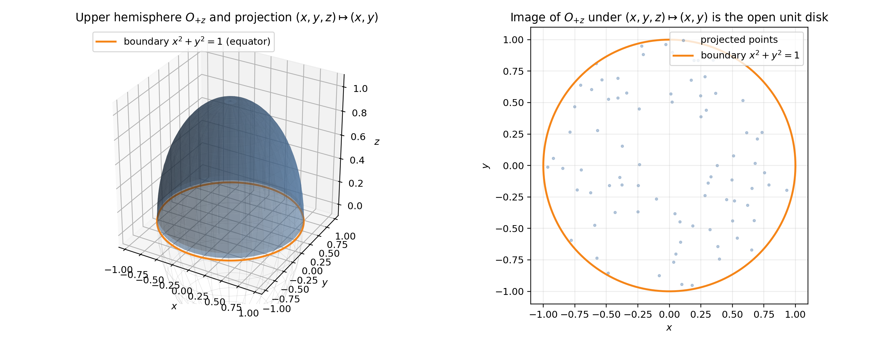
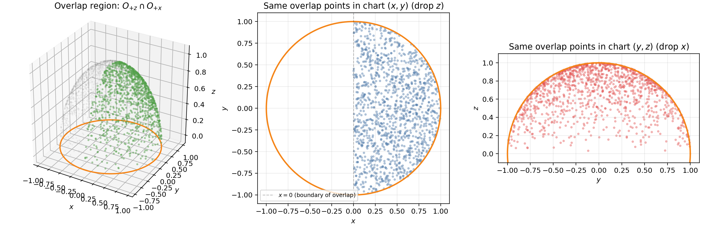
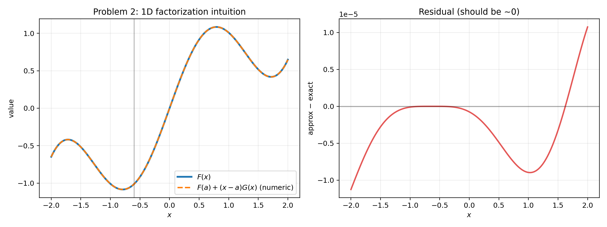
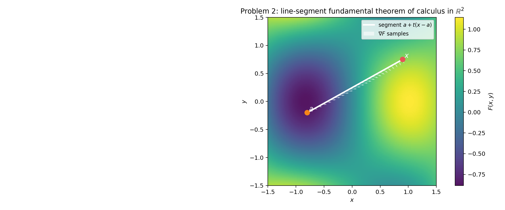
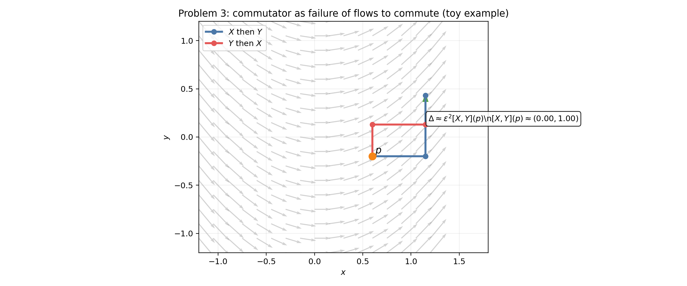
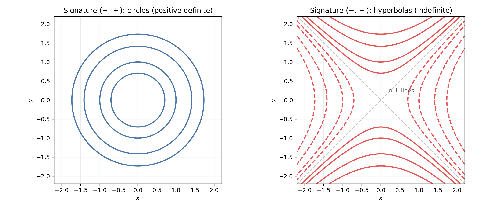
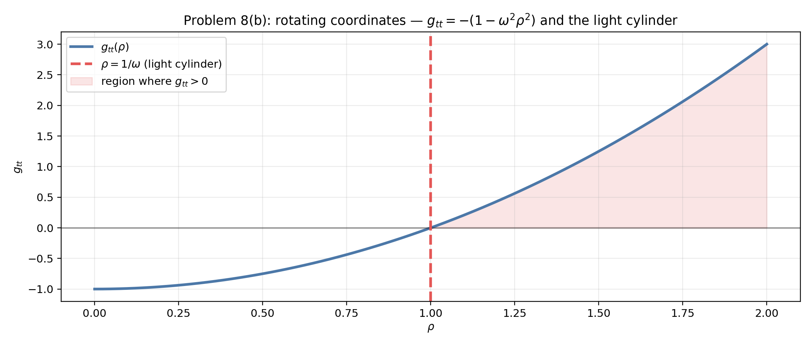

# Wald — General Relativity — Chapter 2
## Socratic Study Guide + Visualization Suite

This guide is built to help you **solve** the Chapter 2 problems yourself while still having a “fast-forward” option when you feel stuck.

### How to use this document

For each problem:
- Try the **Check Your Understanding** questions first.
- Use the **Hint ladder** if you get stuck.
- Only open the **Solution (hidden)** dropdown after you’ve tried honestly.

### Visualizations

- **Static figures** live in `figures/`
- **Interactive suite**: open `interactive/visualization_suite.html` in your browser

If you ever want to regenerate the static figures:

```bash
python3 scripts/problem1a_visualize_charts.py
python3 scripts/generate_ch2_visualizations.py
```

---

## Problem 1 — $S^2$ is a smooth manifold (charts + transition maps)

### Visual intuition





Also see the interactive module **“Problem 1 — Charts on $S^2$”** in `interactive/visualization_suite.html`.

### Check Your Understanding

> Q1: Why does the projection $(x,y,z)\mapsto(x,y)$ fail to be injective on all of $S^2$?

> Q2: On $O_{+z}=\{z>0\}$, why does the image land in the **open** disk $x^2+y^2<1$ (not the closed disk)?

> Q3: What is the inverse map $(x,y)\mapsto(x,y,z)$ on $O_{+z}$, and why is it smooth on the open disk?

### Hint ladder

<details>
<summary>Hint 1</summary>

Use the constraint $x^2+y^2+z^2=1$ to solve for the “dropped” coordinate. The strict inequality defining the hemisphere picks a unique sign.
</details>

<details>
<summary>Hint 2</summary>

On $O_{+z}$, $z=+\sqrt{1-x^2-y^2}$. The radicand is $>0$ precisely on the open disk.
</details>

<details>
<summary>Hint 3</summary>

A transition map like $f_{+x}\circ f_{+z}^{-1}$ is built by: (i) reconstruct the missing coordinate using a square root, then (ii) drop a different coordinate. Smoothness is checked on the overlap domain, where the radicand stays $>0$.
</details>

### Solution (hidden)

<details>
<summary>Open solution walkthrough</summary>

**Step 0: Setup.** Define
$$
S^2=\{(x,y,z)\in\mathbb{R}^3:\ x^2+y^2+z^2=1\}.
$$
Let the six hemispheres be
$$
O_{\pm x}=\{\pm x>0\},\quad O_{\pm y}=\{\pm y>0\},\quad O_{\pm z}=\{\pm z>0\}.
$$

**Step 1: Each chart maps to an open disk.** For example on $O_{+z}$ define
$$
f_{+z}:O_{+z}\to D,\qquad f_{+z}(x,y,z)=(x,y),
$$
where $D=\{(u,v)\in\mathbb{R}^2:\ u^2+v^2<1\}$.

If $(x,y,z)\in O_{+z}$ then $z>0$, hence $z^2>0$, and
$$
x^2+y^2=1-z^2<1,
$$
so $(x,y)\in D$.

**Step 2: Inverse map exists and is smooth.** Given $(u,v)\in D$, define
$$
f_{+z}^{-1}(u,v)=(u,v,\sqrt{1-u^2-v^2}).
$$
The radicand $1-u^2-v^2$ is strictly positive on $D$, so $\sqrt{\cdot}$ is smooth there; hence $f_{+z}^{-1}$ is smooth.

**Step 3: Transition maps are smooth.** Consider a representative overlap, e.g.
$$
O_{+z}\cap O_{+x}=\{z>0,\ x>0\}.
$$
In $(x,y)$-coordinates (the $+z$ chart), this overlap corresponds to
$$
\{(x,y)\in D:\ x>0\},
$$
an open half-disk. On this domain, the transition to the $+x$ chart is
$$
f_{+x}\circ f_{+z}^{-1}(x,y)=f_{+x}\big(x,y,\sqrt{1-x^2-y^2}\big)=(y,\sqrt{1-x^2-y^2}),
$$
which is a composition of smooth functions on the overlap domain.

All other overlaps are the same up to permuting coordinates/signs, so all transition maps are $C^\infty$.

**Conclusion:** These charts form a smooth atlas, hence $S^2$ is a smooth 2‑manifold.

</details>

---

## Problem 2 — The factorization identity (Eq. 2.2.2)

### Visual intuition





### Check Your Understanding

> Q1: Define $g(t)=F(a+t(x-a))$. What is $g'(t)$ in terms of $\partial_\mu F$?

> Q2: How does the fundamental theorem of calculus give $F(x)-F(a)=\int_0^1 g'(t)\,dt$?

> Q3: Where do the factors $(x^\mu-a^\mu)$ come from?

### Hint ladder

<details><summary>Hint 1</summary>

Use $g(1)-g(0)=\int_0^1 g'(t)\,dt$ and the chain rule for $g'(t)$.
</details>

<details><summary>Hint 2</summary>

Chain rule gives $g'(t)=\sum_{\mu}(x^\mu-a^\mu)\,\partial_\mu F(a+t(x-a))$.
</details>

<details><summary>Hint 3</summary>

Define $H_\mu(x)=\int_0^1 \partial_\mu F(a+t(x-a))\,dt$ and factor $(x^\mu-a^\mu)$ out of the integral.
</details>

### Solution (hidden)

<details><summary>Open solution walkthrough</summary>

Define $g(t)=F(a+t(x-a))$. Then $g(0)=F(a)$ and $g(1)=F(x)$.
By the fundamental theorem of calculus,
$$
F(x)-F(a)=g(1)-g(0)=\int_0^1 g'(t)\,dt.
$$
By the multivariable chain rule,
$$
g'(t)=\sum_{\mu=1}^n (x^\mu-a^\mu)\,\frac{\partial F}{\partial x^\mu}(a+t(x-a)).
$$
Substitute into the integral and define
$$
H_\mu(x)=\int_0^1 \frac{\partial F}{\partial x^\mu}(a+t(x-a))\,dt.
$$
Then
$$
F(x)=F(a)+\sum_{\mu=1}^n (x^\mu-a^\mu)\,H_\mu(x).
$$
Smoothness of $H_\mu$ follows by differentiating under the integral sign (all integrands are smooth).

</details>

---

## Problem 3 — Commutators, Jacobi identity, and structure functions

### Visual intuition



Also see the interactive module **“Problem 3 — Commutator as flow noncommutativity”** in `interactive/visualization_suite.html`.

### Check Your Understanding

> Q1: Why does $[X,Y](f):=X(Y(f))-Y(X(f))$ satisfy the Leibniz rule?

> Q2: Why does the Jacobi identity hold for commutators of operators?

> Q3: If $[Y_i,Y_j]=C^k{}_{ij}Y_k$, what do you get by expanding $[Y_i,[Y_j,Y_k]]+\text{cyclic}=0$?

### Solution (hidden)

<details><summary>Open solution walkthrough</summary>

**(a) Vector field property.** Linearity is immediate. For Leibniz:
$$
[X,Y](fg)=X(Y(fg))-Y(X(fg))
$$
expand using Leibniz on $X$ and $Y$ and observe cancellations; you get
$$
[X,Y](fg)=f[X,Y](g)+g[X,Y](f).
$$

**(b) Jacobi identity.** For any operators $A,B,C$ with $[A,B]=AB-BA$,
$$
[A,[B,C]]+[B,[C,A]]+[C,[A,B]]=0
$$
follows by expanding each term and canceling pairwise (associativity of composition).

**(c) Structure functions identity.** Assume $[Y_i,Y_j]=C^m{}_{ij}Y_m$. Then
$$
[Y_i,[Y_j,Y_k]]=[Y_i, C^m{}_{jk}Y_m]
$$
and using Leibniz for commutator gives
$$
[Y_i,[Y_j,Y_k]] = (Y_i C^m{}_{jk})Y_m + C^m{}_{jk}[Y_i,Y_m]
               = (Y_i C^m{}_{jk})Y_m + C^m{}_{jk}C^\ell{}_{im}Y_\ell.
$$
Sum cyclically in $(i,j,k)$ and equate coefficients of the basis vectors to get the identity:
$$
Y_i C^m{}_{jk} + Y_j C^m{}_{ki} + Y_k C^m{}_{ij}
  + C^\ell{}_{jk}C^m{}_{i\ell} + C^\ell{}_{ki}C^m{}_{j\ell} + C^\ell{}_{ij}C^m{}_{k\ell}
  = 0.
$$

</details>

---

## Problem 4 — Coordinate expression for commutators; dual coframe identity

### Check Your Understanding

> Q1: If $v=v^\mu\partial_\mu$ and $w=w^\mu\partial_\mu$, what is $[v,w](x^\nu)$?

> Q2: Why do coordinate basis vectors commute: $[\partial_\mu,\partial_\nu]=0$?

> Q3: How does $d\theta^a(Y_b,Y_c)=-\theta^a([Y_b,Y_c])$ relate $d\theta^a$ to the structure functions?

### Solution (hidden)

<details><summary>Open solution walkthrough</summary>

**(a)** Compute
$$
[v,w](x^\nu)=v(w(x^\nu))-w(v(x^\nu))=v(w^\nu)-w(v^\nu)=v^\mu\partial_\mu w^\nu-w^\mu\partial_\mu v^\nu.
$$
Thus
$$
[v,w]^\nu = v^\mu\partial_\mu w^\nu - w^\mu\partial_\mu v^\nu.
$$

**(b)** Let $\{\theta^a\}$ be the coframe dual to $\{Y_a\}$. Then
$$
d\theta^a(Y_b,Y_c)=Y_b(\theta^a(Y_c)) - Y_c(\theta^a(Y_b)) - \theta^a([Y_b,Y_c]) = -\theta^a([Y_b,Y_c]) = -C^a{}_{bc}.
$$
So
$$
d\theta^a = -\frac12 C^a{}_{bc}\,\theta^b\wedge\theta^c.
$$
Writing $\theta^a=(\theta^a)_\mu dx^\mu$ and comparing components yields
$$
\partial_\mu(\theta^a)_\nu - \partial_\nu(\theta^a)_\mu = -\,C^a{}_{bc}\,(\theta^b)_\mu(\theta^c)_\nu.
$$

</details>

---

## Problem 5 — Commuting frame $\Rightarrow$ local coordinates

### Check Your Understanding

> Q1: If $C^k{}_{ij}=0$, what does Problem 4(b) say about $d\theta^k$?

> Q2: If $d\theta^k=0$ on a neighborhood, what does that imply about $\theta^k$ (locally)?

> Q3: If $\theta^k=dy^k$, why does that force $Y_k=\partial/\partial y^k$?

### Solution (hidden)

<details><summary>Open solution walkthrough</summary>

If $[Y_i,Y_j]=0$ for all $i,j$, then the structure functions vanish: $C^k{}_{ij}=0$.
By Problem 4(b) this implies $d\theta^k=0$ for the dual coframe $\theta^k$.

Closed 1-forms are locally exact, so on a neighborhood there exist functions $y^k$ with
$$
\theta^k = dy^k.
$$
Duality $\theta^k(Y_j)=\delta^k{}_j$ becomes
$$
dy^k(Y_j)=\delta^k{}_j,
$$
which exactly says $Y_j=\partial/\partial y^j$ in the coordinates $(y^1,\dots,y^n)$.

</details>

---

## Problem 6 — Dual basis expansions and basis-independence of contraction

### Visual intuition


### Check Your Understanding

> Q1: Why is a covector determined by its values on a basis?

> Q2: If $w=\sum_\alpha c_\alpha v_\alpha$, how do you solve for $c_\alpha$ using the dual basis?

> Q3: Under a basis change, why does a contraction “cancel” $A$ with $A^{-1}$?

### Solution (hidden)

<details><summary>Open solution walkthrough</summary>

**(a)** If $\{v_\alpha\}$ is a basis, define $v^{\alpha *}$ by $v^{\alpha *}(v_\beta)=\delta^\alpha{}_\beta$.
Any $\omega\in V^*$ is determined by the numbers $\omega(v_\beta)$, hence it is a linear combination of $v^{\alpha *}$.
Linear independence follows immediately from applying to $v_\beta$.

**(b)** If $w=\sum_\alpha c_\alpha v_\alpha$, apply $v^{\beta *}$:
$$
v^{\beta *}(w)=\sum_\alpha c_\alpha v^{\beta *}(v_\alpha)=\sum_\alpha c_\alpha\delta^\beta{}_\alpha=c_\beta.
$$
So $w=\sum_\alpha v^{\alpha *}(w)v_\alpha$.
Similarly, for $\omega\in V^*$, expand $\omega=\sum_\alpha d_\alpha v^{\alpha *}$ and evaluate on $v_\beta$ to get $d_\beta=\omega(v_\beta)$.

**(c)** Under basis change, contravariant components pick up $A$, covariant pick up $A^{-1}$; contracting one up-index with one down-index pairs them and cancels the matrices, so the contraction is basis-independent.

</details>

---

## Problem 7 — Orthonormal bases and signature invariance

### Visual intuition



### Check Your Understanding

> Q1: What does “orthonormal” mean for an indefinite metric?

> Q2: Why does picking a vector with $g(v,v)\neq 0$ let you split $V=\mathrm{span}\{v\}\oplus v^\perp$?

> Q3: Why can’t the number of $+$ and $-$ signs change under change of orthonormal basis?

### Solution (hidden)

<details><summary>Open solution walkthrough</summary>

**(a)** Induct on $\dim V=n$.
Pick $v$ with $g(v,v)\neq 0$ (nondegeneracy guarantees such a vector exists). Normalize it so $g(v,v)=\pm1$.
Then
$$
V = \mathrm{span}\{v\}\oplus v^\perp,
$$
and $g$ restricted to $v^\perp$ is again nondegenerate. Apply induction to $v^\perp$ to obtain an orthonormal basis there; adjoining $v$ gives the desired basis of $V$.

**(b)** Signature invariance is Sylvester’s law of inertia: any two matrices representing the same bilinear form are related by congruence $G' = A^TGA$, and the numbers of positive/negative eigenvalues are invariant under congruence.

</details>

---

## Problem 8 — Metrics in spherical coordinates; rotating coordinates in Minkowski space

### Visual intuition



Also see the interactive module **“Problem 8 — Rotating coordinates / light cylinder”** in `interactive/visualization_suite.html`.

### Check Your Understanding

> Q1 (8a): If $x=r\sin\theta\cos\phi$, $y=r\sin\theta\sin\phi$, $z=r\cos\theta$, what are $dx,dy,dz$ in terms of $dr,d\theta,d\phi$?

> Q2 (8a): Why do cross terms cancel in $dx^2+dy^2+dz^2$?

> Q3 (8b): If $\phi'=\phi-\omega t$, what is $d\phi$ in terms of $d\phi'$ and $dt$?

### Solution (hidden)

<details><summary>Open solution walkthrough</summary>

**(8a)** Substitute the spherical coordinate differentials into
$$
ds^2 = dx^2+dy^2+dz^2,
$$
and simplify to obtain
$$
ds^2 = dr^2 + r^2 d\theta^2 + r^2\sin^2\theta\, d\phi^2.
$$

**(8b)** Start from Minkowski in cylindrical coordinates:
$$
ds^2=-dt^2 + d\rho^2 + \rho^2 d\phi^2 + dz^2.
$$
Define rotating angle $\phi'=\phi-\omega t$ so $d\phi=d\phi' + \omega dt$.
Substitute:
$$
ds^2=-(1-\omega^2\rho^2)\,dt^2 + 2\omega\rho^2\,dt\,d\phi' + d\rho^2 + \rho^2 d\phi'^2 + dz^2.
$$
Thus (in coordinates $(t,\rho,\phi',z)$):
$$
g_{tt}=-(1-\omega^2\rho^2),\quad g_{t\phi'}=\omega\rho^2,\quad g_{\phi'\phi'}=\rho^2,\quad g_{\rho\rho}=1,\quad g_{zz}=1.
$$
Inverting the $(t,\phi')$ block gives
$$
g^{tt}=-1,\quad g^{t\phi'}=\omega,\quad g^{\phi'\phi'}=\rho^{-2}-\omega^2,
$$
with $g^{\rho\rho}=1$ and $g^{zz}=1$.

</details>


