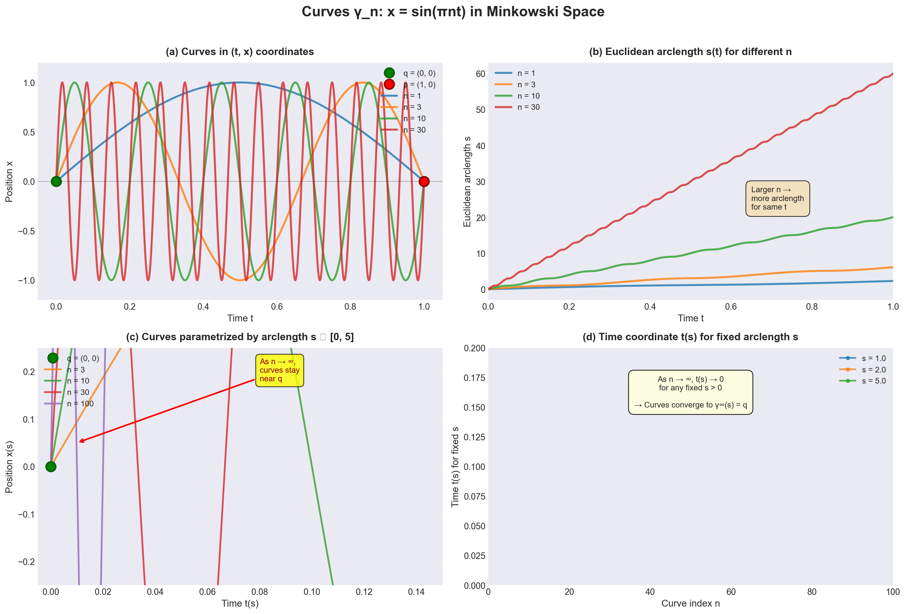
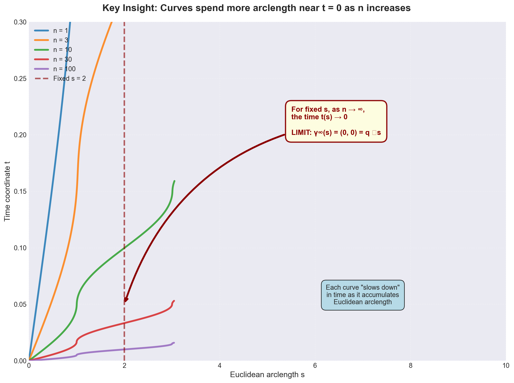

# Physics 539 - Problem Set 1 Solutions
## Due September 21

---

## Problem 1: Convergence of Curves in Minkowski Space

### Problem Statement

Recall that in class, in two-dimensional Minkowski space $M$ with coordinates $(t, x)$ and metric $ds^2 = -dt^2 + dx^2$, we considered the sequence of curves $\gamma_n$, $n = 1, 2, 3, \ldots$, defined by:

$$x = \sin(\pi n t)$$

If we consider only the portion of these curves with $0 \leq t \leq 1$, we can regard them as non-causal curves from $q = (0, 0)$ to $p = (1, 0)$. As such, they have no limit.

On the other hand, let us consider the same curves over the larger range $0 \leq t < \infty$. As such, we can consider them as inextendible curves in $M$ that all start at the point $q$. We pick a complete Euclidean metric on $M$ (such as $ds_E^2 = dt^2 + dx^2$) and parametrize the $\gamma_n$ by Euclidean arclength. In class we proved that a sequence of inextendible curves from a fixed initial point (whether causal or not), parametrized in this way by arclength in a complete Euclidean metric, always has a convergent subsequence.

In this exercise, you will resolve the tension between these different statements.

**(a)** Viewing the $\gamma_n$ as inextendible curves with $0 \leq t < \infty$, find a convergent subsequence and describe what it converges to.

**(b)** Is your answer in (a) a curve from $q$ to $p$ (which might contradict the statement that the $\gamma_n$, viewed as curves from $q$ to $p$, do not have a limit)?

---

### Solution Overview
- 2D Minkowski space with metric: $ds^2 = -dt^2 + dx^2$
- Sequence of curves: $\gamma_n: x = \sin(\pi n t)$
- For $0 \leq t \leq 1$: no limit as curves from $q=(0,0)$ to $p=(1,0)$
- Now consider: $0 \leq t < \infty$ (inextendible curves)
- Parametrize by Euclidean arclength with $ds_E^2 = dt^2 + dx^2$

---

### (a) Finding the Convergent Subsequence

**Parametrization by Euclidean Arclength:**

For $\gamma_n: x = \sin(\pi n t)$, we have:
- $\frac{dx}{dt} = \pi n \cos(\pi n t)$
- Euclidean arclength element: $ds_E = \sqrt{1 + (\pi n \cos(\pi n t))^2} \, dt$

**Key Observation:** As $n \to \infty$, the curves $\gamma_n$ oscillate more and more rapidly. Let's analyze their behavior:

The Euclidean arclength from $t=0$ to some time $t_0$ is:
$$s_n(t_0) = \int_0^{t_0} \sqrt{1 + \pi^2 n^2 \cos^2(\pi n t)} \, dt$$

For large $n$, when $\cos(\pi n t) \neq 0$, the integrand is approximately $\pi n |\cos(\pi n t)|$, so:
$$s_n(t_0) \approx \pi n \int_0^{t_0} |\cos(\pi n t)| \, dt = \pi n \cdot \frac{2}{\pi n} \cdot \lfloor \pi n t_0 \rfloor + O(1) \approx 2\lfloor \pi n t_0 \rfloor$$

This grows linearly with $n$ for fixed $t_0 > 0$.

**Finding the Limit:**

When we parametrize by Euclidean arclength $s$, for a given arclength parameter $s_0$, as $n \to \infty$:
- The corresponding time $t_n(s_0) \to 0$ as $n \to \infty$
- This is because it takes increasingly more arclength to traverse even a small time interval

**The Convergent Subsequence:**

The subsequence $\gamma_n$ (actually the entire sequence) converges to the **constant curve** $\gamma_\infty(s) = (0, 0) = q$.

More precisely: When parametrized by Euclidean arclength $s \geq 0$, for any fixed $s$, we have:
$$\lim_{n \to \infty} \gamma_n(s) = (0, 0)$$

The limiting curve is the degenerate curve that remains at the initial point $q$ for all parameter values.

*Figure 1: (a) Curves γ_n in (t,x) coordinates showing increasing oscillation frequency. (b) Euclidean arclength accumulation. (c) Curves parametrized by arclength converge near q. (d) Time coordinate t(s) → 0 as n → ∞ for fixed arclength s.*

---

### (b) Is the Limit a Curve from q to p?

**Answer: NO**

The limit curve $\gamma_\infty$ is **not** a curve from $q$ to $p$. Instead, it is a constant curve that stays at $q = (0,0)$ forever.

**Resolution of the Apparent Tension:**

This resolves the tension between the two statements:

1. **As curves from q to p (with $0 \leq t \leq 1$):** The $\gamma_n$ have no limit because they oscillate wildly near $t=1$, and any putative limit would need to reach $p=(1,0)$.

2. **As inextendible curves from q (with $0 \leq t < \infty$):** The curves do have a limit, but this limit is the constant curve at $q$, which never reaches $p$.

The key insight is that the notion of "convergence" depends crucially on:
- The parametrization (Euclidean arclength)
- The topology on the space of curves
- What we mean by "reaching" a point

When parametrized by arclength in a complete metric, the curves "spend" increasingly more arclength near $t=0$, so in the limit, they never leave $q$. This is perfectly consistent with having no limit as curves that actually reach $p$.

*Figure 2: As n increases, curves spend more Euclidean arclength near t=0. For any fixed arclength parameter s, the corresponding time coordinate t(s) approaches 0 as n → ∞, illustrating that the limit curve stays at q forever.*

---

## Problem 2: Compactness of Causal Curves

### Problem Statement

Recall that $C_q^p$ is the space of causal curves from a point $q$ to a point $p$ in its future. Suppose that $M$ is globally hyperbolic with Cauchy hypersurface $S$. In class, we showed that $C_q^p$ is compact if $q, p$ are both to the past or both to the future of $S$. Show that this is also true if $q$ is to the past of $S$ and $p$ is to its future.

---

### Setup
- $M$ is globally hyperbolic with Cauchy surface $S$
- $C_q^p$ = space of causal curves from $q$ to $p$
- Known: $C_q^p$ is compact when both $q, p$ are to the past of $S$, or both to the future of $S$
- To prove: $C_q^p$ is compact when $q$ is to the past of $S$ and $p$ is to the future of $S$

---

### Proof

**Step 1: Setup**

Let $q \in I^-(S)$ (in the past of $S$) and $p \in I^+(S)$ (in the future of $S$).

Since $M$ is globally hyperbolic, every inextendible causal curve intersects $S$ exactly once. Therefore, any causal curve from $q$ to $p$ must intersect $S$ at some point.

**Step 2: Decomposition**

For any curve $\gamma \in C_q^p$, let $r = \gamma \cap S$ be the intersection point with $S$. Then:
$$\gamma = \gamma_1 * \gamma_2$$
where:
- $\gamma_1 \in C_q^r$ is a causal curve from $q$ to $r$, lying entirely in $I^-(S) \cup S$
- $\gamma_2 \in C_r^p$ is a causal curve from $r$ to $p$, lying entirely in $S \cup I^+(S)$

**Step 3: Compactness of the Pieces**

By the theorem stated in class:
- $C_q^r$ is compact (since both $q$ and $r$ are to the past of or on $S$)
- $C_r^p$ is compact (since both $r$ and $p$ are on or to the future of $S$)

**Step 4: Compactness of the Whole**

Define the map:
$$\Phi: \bigcup_{r \in S} C_q^r \times C_r^p \to C_q^p$$
$$\Phi(\gamma_1, \gamma_2) = \gamma_1 * \gamma_2$$

This is the concatenation map.

**Step 5: Using Causality**

The key observation is that $S$ is a Cauchy surface, so:
- The set $J^+(q) \cap S$ (the future of $q$ intersected with $S$) is compact (by global hyperbolicity)
- The set $J^-(p) \cap S$ (the past of $p$ intersected with $S$) is compact
- Therefore, $K = J^+(q) \cap J^-(p) \cap S$ is compact

Any curve from $q$ to $p$ must intersect $S$ at a point in $K$.

**Step 6: Conclusion**

We can write:
$$C_q^p = \Phi\left(\bigcup_{r \in K} C_q^r \times C_r^p\right)$$

Now:
- For each $r \in K$, the space $C_q^r \times C_r^p$ is compact (as a product of compact spaces)
- The union is over $r \in K$, which is a compact subset of $S$

The space of causal curves has a natural topology (the compact-open topology), and in this topology:
- The concatenation map $\Phi$ is continuous
- The domain can be viewed as a "continuous family" over the compact set $K$

By standard results in the theory of curve spaces on globally hyperbolic spacetimes:
- The union $\bigcup_{r \in K} C_q^r \times C_r^p$ is compact
- The continuous image $\Phi$ of this compact space is compact

Therefore, **$C_q^p$ is compact**.

---

## Problem 3: Computing $R_{tt}$ for the Given Metric

### Problem Statement

Consider the metric:

$$ds^2 = -dt^2 + \sum_{i,j=1}^d g_{ij}(t, \vec{x}) dx^i dx^j$$

(The significance of this metric will be discussed in class.) View $g_{ij}$ as a $d \times d$ matrix ($d = D - 1$, where $D$ is the spacetime dimension) and write $g^{-1}$ for the inverse matrix, and $\dot{g}$ for $\partial g/\partial t$. Verify that:

$$R_{tt} = -\frac{1}{2} \partial_t \text{Tr}(g^{-1}\dot{g}) - \frac{1}{4} \text{Tr}(g^{-1}\dot{g})^2$$

As we will discuss in class, this formula is the key step in deriving Raychaudhuri's equation.

---

### Given Metric
$$ds^2 = -dt^2 + \sum_{i,j=1}^d g_{ij}(t, \vec{x}) dx^i dx^j$$

where $g_{ij}$ is a $d \times d$ matrix (with $d = D-1$), $g^{-1}$ is the inverse matrix, and $\dot{g} = \partial g/\partial t$.

### Goal
Verify that:
$$R_{tt} = -\frac{1}{2} \partial_t \text{Tr}(g^{-1}\dot{g}) - \frac{1}{4} \text{Tr}(g^{-1}\dot{g})^2$$

---

### Solution

**Step 1: Compute Christoffel Symbols**

The metric in matrix form is:
$$g_{\mu\nu} = \begin{pmatrix} -1 & 0 \\ 0 & g_{ij} \end{pmatrix}$$

The inverse metric is:
$$g^{\mu\nu} = \begin{pmatrix} -1 & 0 \\ 0 & g^{ij} \end{pmatrix}$$

Christoffel symbols: $\Gamma^\rho_{\mu\nu} = \frac{1}{2} g^{\rho\sigma}(\partial_\mu g_{\nu\sigma} + \partial_\nu g_{\mu\sigma} - \partial_\sigma g_{\mu\nu})$

**Key Christoffel symbols:**

$\Gamma^t_{ij} = \frac{1}{2} g^{tt}(\partial_i g_{jt} + \partial_j g_{it} - \partial_t g_{ij}) = \frac{1}{2} \dot{g}_{ij}$

$\Gamma^k_{ti} = \Gamma^k_{it} = \frac{1}{2} g^{kl}(\partial_t g_{il} + \partial_i g_{tl} - \partial_l g_{ti}) = \frac{1}{2} g^{kl} \dot{g}_{il}$

$\Gamma^t_{tt} = 0$ (since $g_{tt} = -1$ is constant)

**Step 2: Compute Ricci Tensor Component**

The Ricci tensor is:
$$R_{\mu\nu} = \partial_\rho \Gamma^\rho_{\mu\nu} - \partial_\nu \Gamma^\rho_{\mu\rho} + \Gamma^\rho_{\rho\sigma}\Gamma^\sigma_{\mu\nu} - \Gamma^\rho_{\mu\sigma}\Gamma^\sigma_{\nu\rho}$$

For $R_{tt}$:
$$R_{tt} = \partial_\rho \Gamma^\rho_{tt} - \partial_t \Gamma^\rho_{t\rho} + \Gamma^\rho_{\rho\sigma}\Gamma^\sigma_{tt} - \Gamma^\rho_{t\sigma}\Gamma^\sigma_{t\rho}$$

**Step 3: Evaluate Each Term**

*Term 1:* $\partial_\rho \Gamma^\rho_{tt}$

Since $\Gamma^t_{tt} = 0$ and $\Gamma^i_{tt} = 0$ (no dependence of $g_{tt}$ on spatial coordinates), this term vanishes.

*Term 2:* $-\partial_t \Gamma^\rho_{t\rho} = -\partial_t(\Gamma^t_{tt} + \Gamma^i_{ti})$

$$\Gamma^i_{ti} = \frac{1}{2} g^{ij} \dot{g}_{ij} = \frac{1}{2} \text{Tr}(g^{-1}\dot{g})$$

So:
$$-\partial_t \Gamma^\rho_{t\rho} = -\frac{1}{2} \partial_t \text{Tr}(g^{-1}\dot{g})$$

*Term 3:* $\Gamma^\rho_{\rho\sigma}\Gamma^\sigma_{tt}$

We have $\Gamma^\sigma_{tt} = 0$ for all $\sigma$, so this term vanishes.

*Term 4:* $-\Gamma^\rho_{t\sigma}\Gamma^\sigma_{t\rho}$

$$-\Gamma^\rho_{t\sigma}\Gamma^\sigma_{t\rho} = -\Gamma^t_{ti}\Gamma^i_{tt} - \Gamma^i_{tt}\Gamma^t_{ti} - \Gamma^t_{ti}\Gamma^i_{ti} - \Gamma^i_{tj}\Gamma^j_{ti}$$

The first three terms vanish since $\Gamma^i_{tt} = 0$. The remaining term:

$$-\Gamma^i_{tj}\Gamma^j_{ti} = -\left(\frac{1}{2} g^{ik}\dot{g}_{kj}\right)\left(\frac{1}{2} g^{jl}\dot{g}_{li}\right)$$
$$= -\frac{1}{4} g^{ik}\dot{g}_{kj} g^{jl}\dot{g}_{li}$$
$$= -\frac{1}{4} (g^{-1}\dot{g})^i_j (g^{-1}\dot{g})^j_i$$
$$= -\frac{1}{4} \text{Tr}[(g^{-1}\dot{g})(g^{-1}\dot{g})]$$
$$= -\frac{1}{4} \text{Tr}(g^{-1}\dot{g})^2$$

**Step 4: Final Result**

Combining all terms:
$$\boxed{R_{tt} = -\frac{1}{2} \partial_t \text{Tr}(g^{-1}\dot{g}) - \frac{1}{4} \text{Tr}(g^{-1}\dot{g})^2}$$

This verifies the desired formula. ✓

---

## Notes on Raychaudhuri's Equation

This formula for $R_{tt}$ is indeed the key step in deriving Raychaudhuri's equation. In the context of a congruence of timelike geodesics with tangent vector field $u^\mu = (1, 0, 0, \ldots)$ in these coordinates, the expansion $\theta = \nabla_\mu u^\mu$ is related to $\text{Tr}(g^{-1}\dot{g})$, and the equation relates the evolution of expansion to the Ricci curvature, shear, and vorticity of the congruence.

