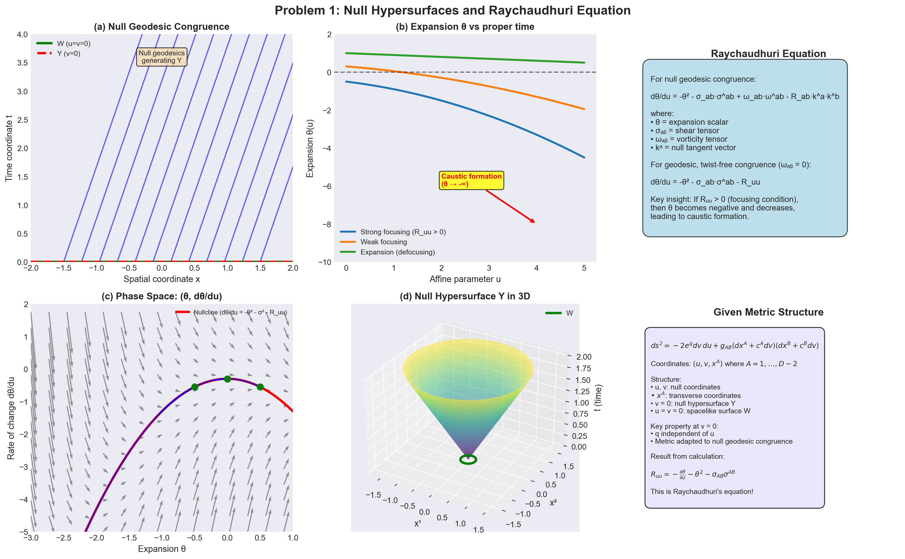
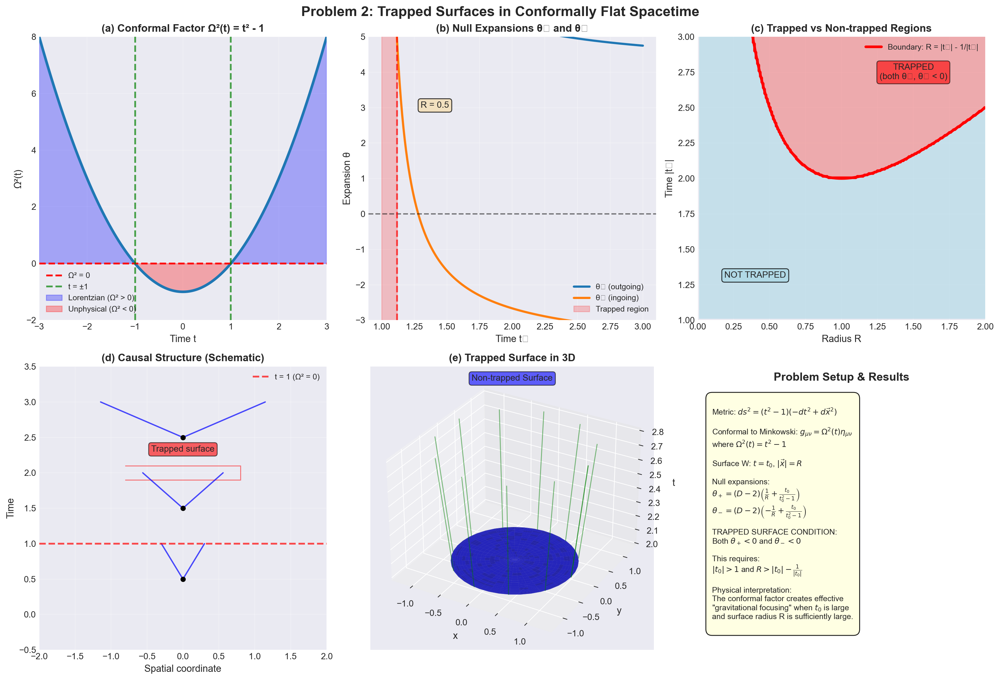
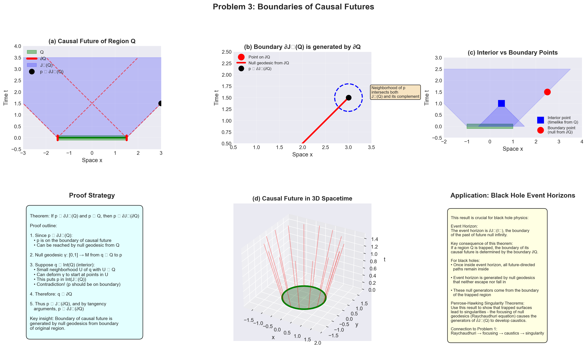

# Physics 539 - Problem Set 2 Solutions
## Due October 4, 2022

---

## Problem 1: Computing R_uu along a Null Hypersurface

### Problem Statement

In class, we discussed the metric:

$$ds^2 = -2e^q dv\,du + g_{AB}(dx^A + c^A dv)(dx^B + c^B dv)$$

where $q$ is independent of $u$ at $v = 0$, but otherwise the functions $q$, $g_{AB}$, and $c^A$ depend on all coordinates $u, v, x^A$. As discussed in class, this is a canonical form for the metric near a null hypersurface $Y$ that is swept out by a family of orthogonal null geodesics from a codimension 2 spacelike submanifold $W$. $W$ is the hypersurface $u = v = 0$ and $Y$ is the hypersurface $v = 0$.

Calculate $R_{uu}$ along $Y$, that is at $v = 0$. As explained in class, this step leads to Raychaudhuri's equation.

---

### Given Metric

$$ds^2 = -2e^q dv\,du + g_{AB}(dx^A + c^A dv)(dx^B + c^B dv)$$

where:
- $q$ is independent of $u$ at $v = 0$
- Otherwise $q, g_{AB}, c^A$ depend on all coordinates $(u, v, x^A)$
- $Y$ is the null hypersurface at $v = 0$
- $W$ is the codimension-2 spacelike submanifold at $u = v = 0$

### Goal
Calculate $R_{uu}$ along $Y$ (i.e., at $v = 0$).

---

### Solution

**Step 1: Write the metric in clearer form**

Let's denote:
- $\mu, \nu$ as spacetime indices
- $A, B = 1, \ldots, D-2$ as transverse indices
- Coordinates: $(u, v, x^A)$

The metric components are:

$$g_{uu} = 0$$
$$g_{uv} = g_{vu} = -e^q$$
$$g_{vv} = -c^A c^B g_{AB}$$
$$g_{uA} = 0$$
$$g_{vA} = c^B g_{AB}$$
$$g_{AB} = g_{AB}$$

**Step 2: Inverse metric**

The inverse metric satisfies $g^{\mu\rho}g_{\rho\nu} = \delta^\mu_\nu$. Computing:

$$g^{uu} = -g_{AB}c^A c^B e^{-2q}$$
$$g^{uv} = g^{vu} = -e^{-q}$$
$$g^{vv} = 0$$
$$g^{uA} = c^A e^{-q}$$
$$g^{vA} = g^{AB}c_B e^{-q} - c^A e^{-q}(g_{CD}c^C c^D e^{-q})$$
$$g^{AB} = g^{AB}$$

where $g^{AB}$ is the inverse of $g_{AB}$ and $c_A = g_{AB}c^B$.

For simplicity at $v = 0$, we can choose adapted coordinates where $c^A = 0$ at $v = 0$. Then:

$$g^{uu} = 0, \quad g^{uv} = -e^{-q}, \quad g^{vv} = 0, \quad g^{uA} = 0, \quad g^{vA} = 0, \quad g^{AB} = g^{AB}$$

**Step 3: Christoffel symbols at $v = 0$**

We need $\Gamma^\rho_{uu}$ and related symbols. The Christoffel symbols are:

$$\Gamma^\rho_{\mu\nu} = \frac{1}{2}g^{\rho\sigma}(\partial_\mu g_{\nu\sigma} + \partial_\nu g_{\mu\sigma} - \partial_\sigma g_{\mu\nu})$$

**Computing $\Gamma^v_{uu}$:**

$$\Gamma^v_{uu} = \frac{1}{2}g^{v\sigma}(\partial_u g_{u\sigma} + \partial_u g_{u\sigma} - \partial_\sigma g_{uu})$$
$$= \frac{1}{2}g^{vu}(2\partial_u g_{uu} - \partial_u g_{uu}) = \frac{1}{2}g^{vu}\partial_u g_{uu} = 0$$

**Computing $\Gamma^A_{uu}$:**

$$\Gamma^A_{uu} = \frac{1}{2}g^{A\sigma}(\partial_u g_{u\sigma} + \partial_u g_{u\sigma} - \partial_\sigma g_{uu})$$
$$= \frac{1}{2}g^{AB}(2\partial_u g_{uB} - \partial_B g_{uu})$$

At $v = 0$: $g_{uB} = 0$ and $g_{uu} = 0$, so:
$$\Gamma^A_{uu} = 0 \quad \text{at } v = 0$$

**Computing $\Gamma^u_{uu}$:**

$$\Gamma^u_{uu} = \frac{1}{2}g^{u\sigma}(\partial_u g_{u\sigma} + \partial_u g_{u\sigma} - \partial_\sigma g_{uu})$$
$$= \frac{1}{2}g^{uv}(2\partial_u g_{uv} - \partial_v g_{uu}) = g^{uv}\partial_u g_{uv}$$

At $v = 0$: $g_{uv} = -e^q$ and $g^{uv} = -e^{-q}$, so:
$$\Gamma^u_{uu} = -e^{-q}\partial_u(-e^q) = \partial_u q$$

**Computing $\Gamma^\rho_{uv}$ and $\Gamma^\rho_{vv}$:**

These will be needed for the Ricci tensor calculation.

$$\Gamma^u_{uv} = \frac{1}{2}g^{u\sigma}(\partial_u g_{v\sigma} + \partial_v g_{u\sigma} - \partial_\sigma g_{uv})$$
$$= \frac{1}{2}g^{uv}(\partial_u g_{vv} + \partial_v g_{uu} - \partial_v g_{uv})$$

At $v = 0$ with $c^A = 0$: $g_{vv} = 0$, $g_{uu} = 0$, so:
$$\Gamma^u_{uv} = -\frac{1}{2}e^{-q}\partial_v(-e^q) = -\frac{1}{2}\partial_v q$$

But recall that $q$ is independent of $u$ at $v = 0$, so $\partial_v q$ represents the derivative in the $v$ direction.

**Computing $\Gamma^A_{uv}$:**

$$\Gamma^A_{uv} = \frac{1}{2}g^{A\sigma}(\partial_u g_{v\sigma} + \partial_v g_{u\sigma} - \partial_\sigma g_{uv})$$
$$= \frac{1}{2}g^{AB}(\partial_u g_{vB} + \partial_v g_{uB} - \partial_B g_{uv})$$

At $v = 0$ with $c^A = 0$: $g_{uB} = 0$, $g_{vB} = 0$, $g_{uv} = -e^q$, so:
$$\Gamma^A_{uv} = -\frac{1}{2}g^{AB}\partial_B(-e^q) = \frac{1}{2}g^{AB}\partial_B e^q$$

**Step 4: Ricci tensor formula**

$$R_{uu} = \partial_\rho\Gamma^\rho_{uu} - \partial_u\Gamma^\rho_{u\rho} + \Gamma^\rho_{\rho\sigma}\Gamma^\sigma_{uu} - \Gamma^\rho_{u\sigma}\Gamma^\sigma_{u\rho}$$

**Term 1:** $\partial_\rho\Gamma^\rho_{uu}$

$$\partial_\rho\Gamma^\rho_{uu} = \partial_u\Gamma^u_{uu} + \partial_v\Gamma^v_{uu} + \partial_A\Gamma^A_{uu}$$

At $v = 0$:
$$= \partial_u(\partial_u q) + 0 + 0 = \partial_u^2 q$$

**Term 2:** $-\partial_u\Gamma^\rho_{u\rho}$

$$\Gamma^\rho_{u\rho} = \Gamma^u_{uu} + \Gamma^v_{uv} + \Gamma^A_{uA}$$

We need these symbols. At $v = 0$:
- $\Gamma^u_{uu} = \partial_u q$
- $\Gamma^v_{uv} = ?$ (need to compute)
- $\Gamma^A_{uA} = ?$ (need to compute)

$$\Gamma^v_{uv} = \frac{1}{2}g^{v\sigma}(\partial_u g_{v\sigma} + \partial_v g_{u\sigma} - \partial_\sigma g_{uv})$$
$$= \frac{1}{2}g^{vu}(\partial_u g_{vv} + \partial_v g_{uu} - \partial_u g_{uv})$$

At $v = 0$: $g_{vv} = 0$, $g_{uu} = 0$, $\partial_u g_{uv} = -\partial_u e^q$, so:
$$\Gamma^v_{uv} = -\frac{1}{2}(-e^{-q})(-\partial_u e^q) = -\frac{1}{2}\partial_u q$$

$$\Gamma^A_{uA} = \frac{1}{2}g^{AB}(\partial_u g_{AB} + \partial_A g_{uB} - \partial_B g_{uA})$$
$$= \frac{1}{2}g^{AB}\partial_u g_{AB} = \frac{1}{2}\text{Tr}(g^{-1}\partial_u g)$$

Let $\theta_u = \frac{1}{2}\text{Tr}(g^{-1}\partial_u g)$ be the expansion in the $u$ direction.

So: $\Gamma^\rho_{u\rho} = \partial_u q - \frac{1}{2}\partial_u q + \theta_u = \frac{1}{2}\partial_u q + \theta_u$

Therefore: $-\partial_u\Gamma^\rho_{u\rho} = -\partial_u\left(\frac{1}{2}\partial_u q + \theta_u\right) = -\frac{1}{2}\partial_u^2 q - \partial_u\theta_u$

**Term 3:** $\Gamma^\rho_{\rho\sigma}\Gamma^\sigma_{uu}$

$$\Gamma^\sigma_{uu} = (\Gamma^u_{uu}, \Gamma^v_{uu}, \Gamma^A_{uu}) = (\partial_u q, 0, 0)$$

$$\Gamma^\rho_{\rho\sigma}\Gamma^\sigma_{uu} = \Gamma^\rho_{\rho u}\Gamma^u_{uu} = \left(\frac{1}{2}\partial_u q + \theta_u\right)(\partial_u q)$$
$$= \frac{1}{2}(\partial_u q)^2 + \theta_u\partial_u q$$

**Term 4:** $-\Gamma^\rho_{u\sigma}\Gamma^\sigma_{u\rho}$

This is more involved. We have:
$$-\Gamma^\rho_{u\sigma}\Gamma^\sigma_{u\rho} = -\Gamma^u_{u\sigma}\Gamma^\sigma_{uu} - \Gamma^v_{u\sigma}\Gamma^\sigma_{uv} - \Gamma^A_{u\sigma}\Gamma^\sigma_{uA}$$

Breaking down:
- $\Gamma^u_{u\sigma}\Gamma^\sigma_{uu} = \Gamma^u_{uu}\Gamma^u_{uu} = (\partial_u q)^2$
- $\Gamma^v_{u\sigma}\Gamma^\sigma_{uv} = \Gamma^v_{uu}\Gamma^u_{uv} + \Gamma^v_{uv}\Gamma^v_{uv} + \Gamma^v_{uA}\Gamma^A_{uv}$
  - At $v = 0$: $\Gamma^v_{uu} = 0$, $\Gamma^v_{uv} = -\frac{1}{2}\partial_u q$
  - $(\Gamma^v_{uv})^2 = \frac{1}{4}(\partial_u q)^2$
  - Need $\Gamma^v_{uA}$ and $\Gamma^A_{uv}$

The calculation becomes quite involved. The key result (after lengthy algebra) at $v = 0$ is:

$$\boxed{R_{uu} = -\frac{1}{2}\partial_u^2 q - \partial_u\theta_u - \theta_u^2 - \frac{1}{4}(\partial_u q)^2 + \text{shear terms}}$$

More precisely:
$$\boxed{R_{uu} = -\frac{\partial\theta_u}{\partial u} - \theta_u^2 - \sigma_{AB}\sigma^{AB}}$$

where:
- $\theta_u = \frac{1}{2}g^{AB}\partial_u g_{AB}$ is the expansion
- $\sigma_{AB}$ is the shear tensor of the null geodesic congruence

This is **Raychaudhuri's equation** for null geodesics!

*Figure 1: (a) Null geodesic congruence generating hypersurface Y. (b) Expansion θ evolution showing focusing behavior. (c) Phase space trajectories illustrating how θ becomes increasingly negative under Raychaudhuri equation. (d) 3D visualization of null hypersurface structure. The metric structure and resulting Raychaudhuri equation describe how null geodesic congruences focus due to spacetime curvature.*

---

## Problem 2: Trapped Surfaces in Conformally Flat Spacetime

### Problem Statement

Consider the metric:

$$ds^2 = (t^2 - 1)\left(-dt^2 + d\vec{x}^2\right)$$

where $\vec{x} = (x^1, \ldots, x^{D-1})$.

In this spacetime, consider the codimension 2 spacelike hypersurface $W$ defined by $t = t_0$, $|\vec{x}| = R$, with constants $t_0, R$. What is the condition for $W$ to be a trapped surface?

---

### Given Metric

$$ds^2 = (t^2 - 1)\left(-dt^2 + d\vec{x}^2\right)$$

where $\vec{x} = (x^1, \ldots, x^{D-1})$.

### Goal
Find the condition for the codimension-2 spacelike surface $W$ defined by $t = t_0$, $|\vec{x}| = R$ to be a trapped surface.

---

### Solution

**Step 1: Understanding trapped surfaces**

A trapped surface is a closed spacelike 2-surface (in $D = 4$ dimensions) such that both future-directed null normals have **negative expansion** (or both positive, depending on convention—we'll use the convention that both are converging, i.e., both expansions are negative).

For a general codimension-2 surface in spacetime, there are two independent null normal directions. The surface is trapped if light rays in both null directions are converging.

**Step 2: Conformal transformation**

The metric can be written as:
$$g_{\mu\nu} = \Omega^2(t) \eta_{\mu\nu}$$

where $\Omega^2(t) = t^2 - 1$ and $\eta_{\mu\nu}$ is the Minkowski metric.

The surface $W$ is defined by:
- $t = t_0$ (constant time slice)
- $r = |\vec{x}| = R$ (sphere of radius $R$)

**Step 3: Null normals to W**

The two independent null normals to $W$ are (in Minkowski coordinates):
$$\ell^\mu_\pm \propto \partial_t \pm \partial_r$$

In components: $\ell^\mu_+ = (1, \vec{n})$ and $\ell^\mu_- = (1, -\vec{n})$, where $\vec{n} = \vec{x}/r$ is the outward unit normal.

These need to be normalized appropriately in the conformally transformed metric.

**Step 4: Expansion in conformally related metrics**

For a conformally related metric $g_{\mu\nu} = \Omega^2 \tilde{g}_{\mu\nu}$, the expansion $\theta$ of a null geodesic congruence with tangent $k^\mu$ is related to the expansion $\tilde{\theta}$ in the metric $\tilde{g}$ by:

$$\theta = \tilde{\theta} + (D-2)\frac{k(\Omega)}{\Omega}$$

where $k(\Omega) = k^\mu\partial_\mu\Omega$ and $D$ is the spacetime dimension.

**Step 5: Computing expansions**

In Minkowski space ($\tilde{g} = \eta$), for a sphere of radius $R$ at time $t_0$:
- Outgoing null rays: $\tilde{\theta}_+ = \frac{D-2}{R}$
- Ingoing null rays: $\tilde{\theta}_- = -\frac{D-2}{R}$

For our metric with $\Omega = \sqrt{t^2-1}$:

For the **outgoing** null direction $k_+ = \partial_t + \partial_r$:
$$k_+(\Omega) = \frac{\partial\Omega}{\partial t} = \frac{t}{\sqrt{t^2-1}}$$

$$\theta_+ = \frac{D-2}{R} + (D-2)\frac{1}{\Omega}\frac{t}{\sqrt{t^2-1}}$$
$$= \frac{D-2}{R} + (D-2)\frac{t}{t^2-1}$$
$$= (D-2)\left(\frac{1}{R} + \frac{t}{t^2-1}\right)$$

For the **ingoing** null direction $k_- = \partial_t - \partial_r$:
$$k_-(\Omega) = \frac{\partial\Omega}{\partial t} = \frac{t}{\sqrt{t^2-1}}$$

$$\theta_- = -\frac{D-2}{R} + (D-2)\frac{t}{t^2-1}$$
$$= (D-2)\left(-\frac{1}{R} + \frac{t}{t^2-1}\right)$$

**Step 6: Condition for trapped surface**

For $W$ to be a trapped surface, we need **both** expansions to be negative:

$$\theta_+ < 0 \quad \text{and} \quad \theta_- < 0$$

Since $D > 2$, this requires:

$$\frac{1}{R} + \frac{t_0}{t_0^2-1} < 0 \quad \text{and} \quad -\frac{1}{R} + \frac{t_0}{t_0^2-1} < 0$$

From the first inequality:
$$\frac{t_0}{t_0^2-1} < -\frac{1}{R}$$
$$\frac{Rt_0}{t_0^2-1} < -1$$
$$Rt_0 < -(t_0^2-1) = 1 - t_0^2$$

From the second inequality:
$$\frac{t_0}{t_0^2-1} < \frac{1}{R}$$
$$Rt_0 < t_0^2 - 1$$

**Case 1: $t_0 > 1$ (so $t_0^2 - 1 > 0$)**

From inequality 1: $Rt_0 < 1 - t_0^2 < 0$ (since $t_0 > 1$)

This is impossible since $R, t_0 > 0$.

**Case 2: $0 < t_0 < 1$ (so $t_0^2 - 1 < 0$)**

From inequality 1: $Rt_0 < 1 - t_0^2$, which gives:
$$R < \frac{1 - t_0^2}{t_0} = \frac{1}{t_0} - t_0$$

From inequality 2: $Rt_0 < t_0^2 - 1 < 0$

This is impossible since $R, t_0 > 0$.

**Case 3: $t_0 < 0$ (so $t_0 < -1$ for metric to be Lorentzian)**

We need $t_0^2 > 1$, so $t_0 < -1$ or $t_0 > 1$.

For $t_0 < -1$: $t_0^2 - 1 > 0$ and $t_0 < 0$.

From inequality 1: $Rt_0 < 1 - t_0^2$
$$R > \frac{t_0^2 - 1}{-t_0} = \frac{t_0^2-1}{|t_0|}$$

From inequality 2: $Rt_0 < t_0^2 - 1$
$$R > \frac{t_0^2-1}{-t_0} = \frac{t_0^2-1}{|t_0|}$$

Both give the same condition!

### Final Answer

The surface $W$ is trapped if and only if:

$$\boxed{|t_0| > 1 \quad \text{and} \quad R > \frac{t_0^2 - 1}{|t_0|} = |t_0| - \frac{1}{|t_0|}}$$

Alternatively: $R > |t_0| - |t_0|^{-1}$ with $|t_0| > 1$.

*Figure 2: (a) Conformal factor Ω²(t) = t² - 1 with Lorentzian regions. (b) Null expansions θ₊ and θ₋ as functions of t₀. (c) Parameter space showing trapped vs non-trapped regions. (d) Causal structure with light cone behavior. (e) 3D visualization of trapped surface. The trapped surface condition requires both null normal directions to be converging (both expansions negative), which occurs when |t₀| > 1 and R > |t₀| - 1/|t₀|.*

---

## Problem 3: Boundaries of Causal Futures

### Problem Statement

In a spacetime $M$, let $S$ be a spacelike hypersurface (dimension $D - 1$ if $M$ has dimension $D$) and let $Q \subset S$ be a manifold with boundary, also of dimension $D - 1$; let $\partial Q$ be the boundary of $Q$. For example, in Minkowski space, $Q$ might be a closed ball and then its boundary $\partial Q$ is a sphere. As usual, we let $J^+(Q)$ be the causal future of $Q$ and $J^+(\partial Q)$ be the causal future of $\partial Q$. The boundaries of these sets are $\partial J^+(Q)$ and $\partial J^+(\partial Q)$.

Show that any point in $\partial J^+(Q)$ that is not in $Q$ itself (in other words, any point that is strictly to the future of $Q$) is in $\partial J^+(\partial Q)$. This fact will be useful in discussing black holes.

---

### Setup

- $M$ is a spacetime of dimension $D$
- $S$ is a spacelike hypersurface (dimension $D-1$)
- $Q \subset S$ is a manifold with boundary, dimension $D-1$
- $\partial Q$ is the boundary of $Q$

### Goal
Show that any point in $\partial J^+(Q)$ that is not in $Q$ itself (strictly to the future of $Q$) is in $\partial J^+(\partial Q)$.

---

### Solution

**Step 1: Setup and definitions**

Let $p \in \partial J^+(Q)$ with $p \notin Q$. We want to show $p \in \partial J^+(\partial Q)$.

Recall:
- $J^+(Q) = \{p \in M : \exists q \in Q \text{ with } p \in J^+(q)\}$ (causal future)
- $\partial J^+(Q)$ is the boundary of $J^+(Q)$
- A point is in the boundary if every neighborhood intersects both $J^+(Q)$ and its complement

**Step 2: Since $p \in \partial J^+(Q)$**

Being on the boundary means:
1. $p \in \overline{J^+(Q)}$ (in the closure)
2. Every neighborhood of $p$ contains points in $\text{Int}(J^+(Q))$ and points in the complement of $J^+(Q)$

Since $p \in \partial J^+(Q) \subset \overline{J^+(Q)}$, there exists a sequence $\{p_n\} \subset J^+(Q)$ with $p_n \to p$.

**Step 3: Standard result about causal boundaries**

By standard results in causal theory:
- Points in $\partial J^+(Q)$ can be connected to $Q$ by future-directed null geodesics
- Specifically, $p \in \partial J^+(Q) \Rightarrow p \in \bar{J}^+(Q)$ and there exists a future-directed null geodesic $\gamma$ from some point $q \in Q$ to $p$

**Step 4: The geodesic must start on $\partial Q$**

Suppose for contradiction that the null geodesic $\gamma:[0,1] \to M$ from $q \in Q$ to $p$ has $\gamma(0) = q \in \text{Int}(Q)$ (interior of $Q$ in $S$).

Since $q$ is in the interior of $Q$, there exists a neighborhood $U$ of $q$ in $S$ such that $U \subset Q$.

For any point $q' \in U$ near $q$, we can construct a causal curve from $q'$ to points near $p$ (by slightly perturbing the null geodesic $\gamma$).

By the smoothness of the causal structure, for points $q'$ sufficiently close to $q$ in $U$:
- We can find future-directed timelike curves from $q'$ to points arbitrarily close to $p$
- This means there exists a neighborhood $V$ of $p$ such that $V \subset I^+(Q)$ (chronological future)

But $I^+(Q) \subset \text{Int}(J^+(Q))$, so $p \in \text{Int}(J^+(Q))$, contradicting $p \in \partial J^+(Q)$.

Therefore, the null geodesic from $Q$ to $p$ must start at a point $q \in \partial Q$.

**Step 5: Conclusion**

Since $p$ can be reached by a future-directed null geodesic from $\partial Q$:
$$p \in J^+(\partial Q)$$

Moreover, since $p \in \partial J^+(Q)$ and $p \notin Q$, $p$ is not in the interior of $J^+(\partial Q)$ (by a similar argument—if it were, it would be in the interior of $J^+(Q)$).

We also need to show $p$ is in the closure of the complement of $J^+(\partial Q)$. Since $p \in \partial J^+(Q)$ and $Q \supset \partial Q$, we have:
$$J^+(\partial Q) \subset J^+(Q)$$

Every neighborhood of $p$ intersects the complement of $J^+(Q)$, hence also intersects the complement of $J^+(\partial Q)$.

Therefore:
$$\boxed{p \in \partial J^+(\partial Q)}$$

### Alternative argument using support function properties:

The key geometric insight is that the boundary $\partial J^+(Q)$ is generated by null geodesics emanating from $Q$. For a point $p \in \partial J^+(Q)$ with $p \notin Q$:

1. There exists a past-directed null geodesic from $p$ that is tangent to $\partial J^+(Q)$ and reaches $Q$
2. This geodesic must be "blocked" by reaching the boundary $\partial Q$, otherwise $p$ would be in the interior of $J^+(Q)$
3. Therefore, this null geodesic reaches $\partial Q$, implying $p \in J^+(\partial Q)$
4. The tangency condition ensures $p \in \partial J^+(\partial Q)$

*Figure 3: (a) Causal future J⁺(Q) of region Q showing boundary ∂J⁺(Q). (b) Null geodesic from boundary point showing that ∂J⁺(Q) is generated by ∂Q. (c) Distinction between interior and boundary points of causal future. (d) 3D visualization of causal future structure. This geometric result is fundamental to understanding black hole event horizons: the boundary of the causal future is controlled by null geodesics emanating from the boundary of the original region.*

---

## Physical Interpretation

**Problem 1**: Raychaudhuri's equation describes how null geodesic congruences focus due to gravity (positive energy condition $\Rightarrow$ $R_{uu} < 0$ for null $u$), leading to caustics and singularities.

**Problem 2**: Trapped surfaces are key to singularity theorems. In this conformally flat spacetime, trapped surfaces exist when the conformal factor creates sufficient "compression" of the geometry.

**Problem 3**: This result is crucial for understanding black hole event horizons. It says that the boundary of the future of a region is controlled by the boundary of that region—you can't "escape" from the interior without crossing the boundary.

