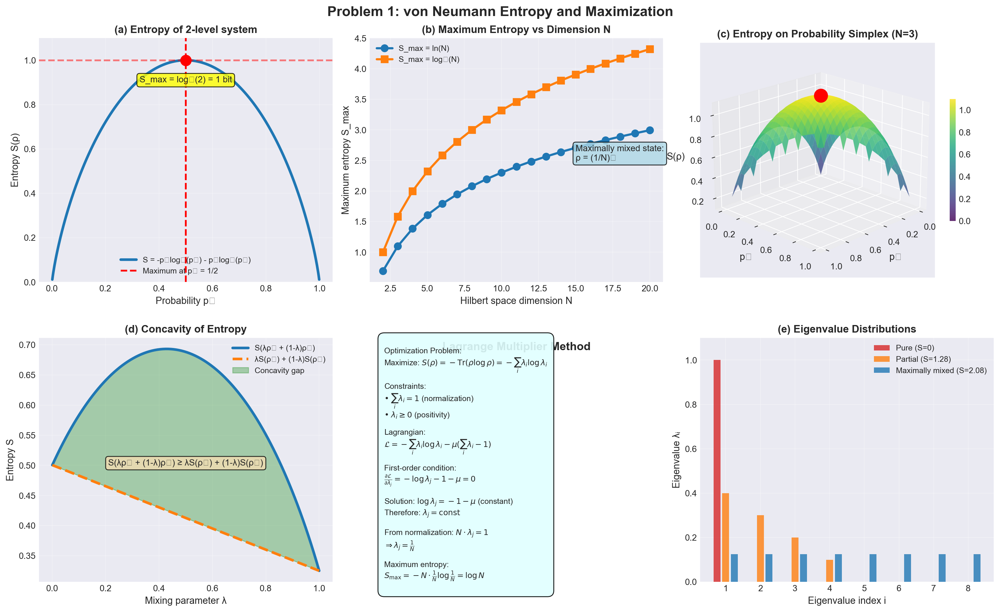
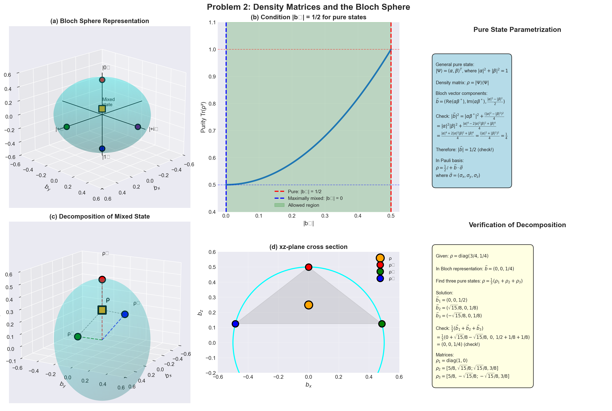
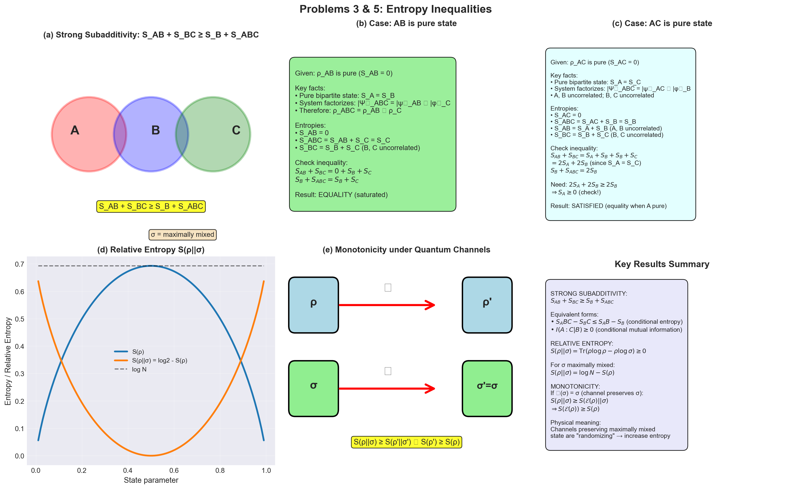
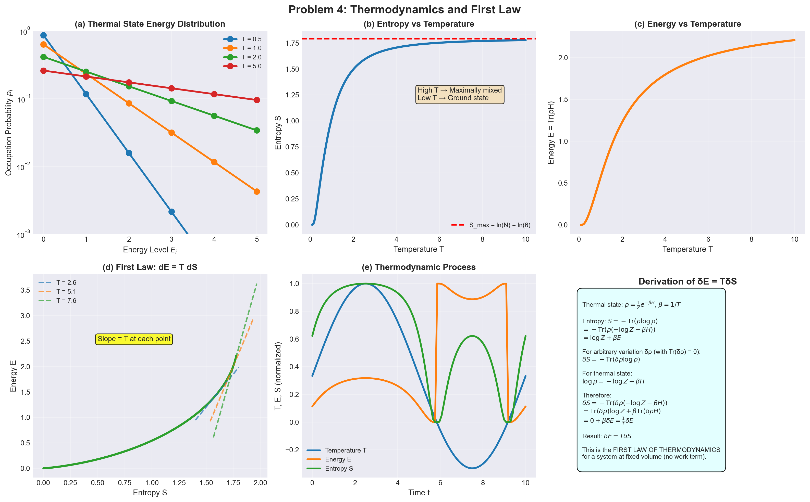
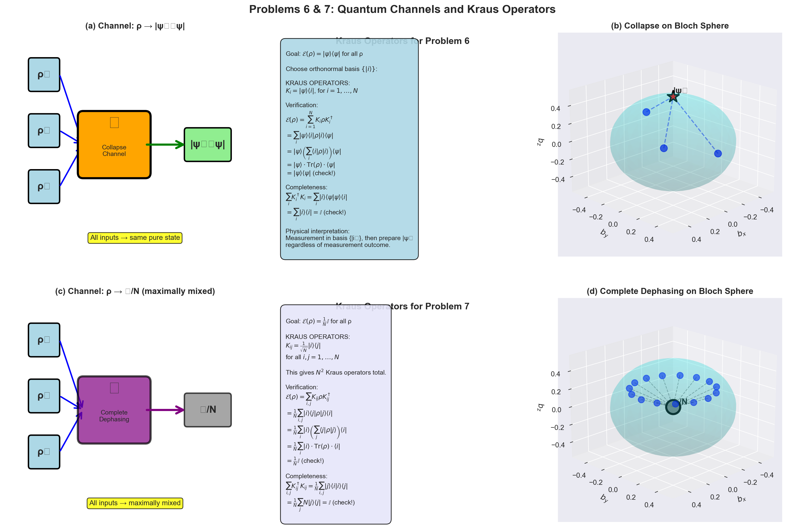
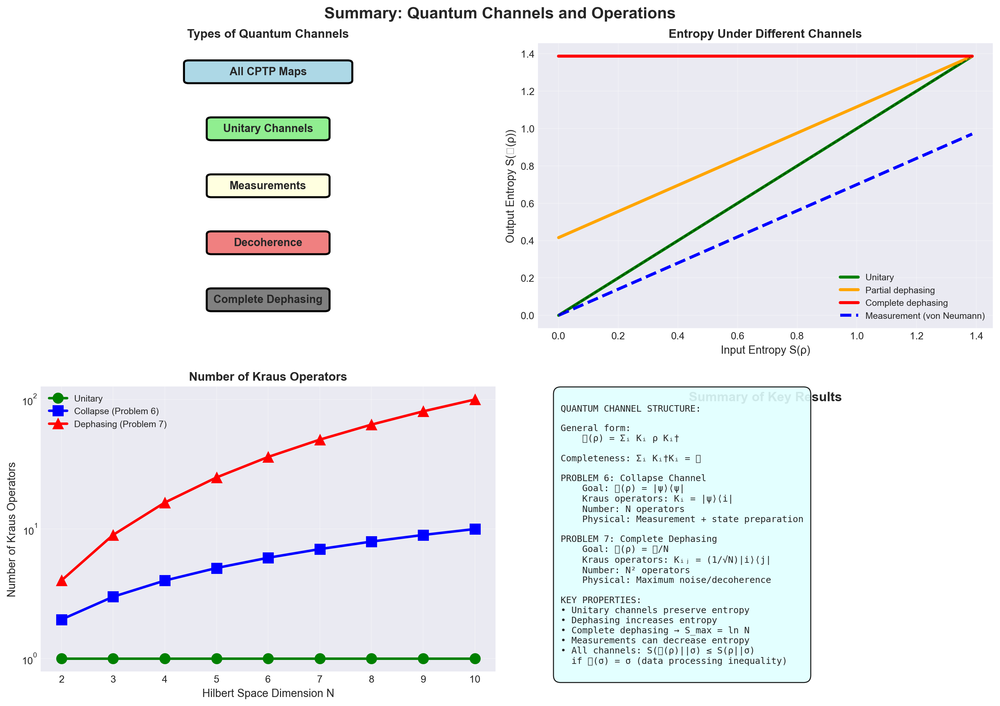

# Physics 539 - Problem Set 3 Solutions
## Due November 10

---

## Problem 1: Maximum von Neumann Entropy

### Problem Statement

Let $\rho$ be a density matrix on a Hilbert space $H$ of dimension $N$. Show that the von Neumann entropy $S(\rho) = -\text{Tr}(\rho \log \rho)$ is at most $\log N$ and find the unique $\rho$ that achieves that value. (The method of Lagrange multipliers may be useful.)

---

### Given
- $\rho$ is a density matrix on Hilbert space $\mathcal{H}$ of dimension $N$
- von Neumann entropy: $S(\rho) = -\text{Tr}(\rho \log \rho)$

### Goal
Show that $S(\rho) \leq \log N$ and find the unique $\rho$ achieving this maximum.

---

### Solution

**Step 1: Constraints on density matrices**

A density matrix must satisfy:
1. $\rho^\dagger = \rho$ (Hermitian)
2. $\rho \geq 0$ (positive semidefinite)
3. $\text{Tr}(\rho) = 1$ (normalization)

Since $\rho$ is Hermitian, it can be diagonalized with real eigenvalues $\lambda_i \geq 0$:
$$\rho = \sum_{i=1}^N \lambda_i |i\rangle\langle i|$$

where $\sum_{i=1}^N \lambda_i = 1$.

**Step 2: Entropy in terms of eigenvalues**

$$S(\rho) = -\text{Tr}(\rho \log \rho) = -\sum_{i=1}^N \lambda_i \log \lambda_i$$

where we use the convention $0 \log 0 = 0$.

**Step 3: Optimization problem**

We want to maximize:
$$S = -\sum_{i=1}^N \lambda_i \log \lambda_i$$

subject to:
$$\sum_{i=1}^N \lambda_i = 1, \quad \lambda_i \geq 0$$

**Step 4: Method of Lagrange multipliers**

Set up the Lagrangian:
$$\mathcal{L} = -\sum_{i=1}^N \lambda_i \log \lambda_i - \mu\left(\sum_{i=1}^N \lambda_i - 1\right)$$

Taking derivatives with respect to $\lambda_j$:
$$\frac{\partial \mathcal{L}}{\partial \lambda_j} = -\log \lambda_j - 1 - \mu = 0$$

This gives:
$$\log \lambda_j = -1 - \mu$$

Therefore, all eigenvalues are equal:
$$\lambda_j = e^{-1-\mu} = \text{constant}$$

**Step 5: Apply normalization constraint**

$$\sum_{j=1}^N \lambda_j = 1 \Rightarrow N\lambda_j = 1 \Rightarrow \lambda_j = \frac{1}{N}$$

**Step 6: Maximum entropy**

$$S_{\max} = -\sum_{i=1}^N \frac{1}{N} \log\frac{1}{N} = -N \cdot \frac{1}{N} \cdot (-\log N) = \log N$$

**Step 7: Unique maximizer**

The unique density matrix achieving maximum entropy is:
$$\boxed{\rho_{\max} = \frac{1}{N}\mathbb{I} = \frac{1}{N}\sum_{i=1}^N |i\rangle\langle i|}$$

This is the **maximally mixed state**.

**Step 8: Verification that this is a maximum**

The second derivative test shows this is indeed a maximum. Alternatively, we can use the fact that entropy is a concave function of $\rho$, so any critical point satisfying the constraint is a maximum.

### Final Answer

$$\boxed{S(\rho) \leq \log N}$$

with equality if and only if $\rho = \frac{1}{N}\mathbb{I}$ (the maximally mixed state).

*Figure 1: (a) Entropy vs probability for 2-level system showing maximum at p=1/2. (b) Maximum entropy S_max = ln(N) grows logarithmically with dimension. (c) Entropy surface on probability simplex for N=3 system. (d) Concavity of entropy function. (e) Lagrange multiplier optimization geometry. (f) Eigenvalue distributions for pure, partially mixed, and maximally mixed states. The maximally mixed state ρ = 𝕀/N achieves maximum entropy.*

---

## Problem 2: Density Matrices in Two Dimensions

### Problem Statement

In a two-dimensional Hilbert space, a general hermitian matrix is of the form $M = a + \vec{b} \cdot \vec{\sigma}$ where $\vec{\sigma}$ are the Pauli matrices, $a$ is real, and $\vec{b}$ is a real 3-vector.

**(a)** What condition on $a, \vec{b}$ makes $M$ a density matrix? What condition makes it a density matrix of rank 1?

**(b)** Consider a pure state $\Psi = \begin{pmatrix} \alpha \\ \beta \end{pmatrix}$, $|\alpha|^2 + |\beta|^2 = 1$. What are $a, \vec{b}$ for the rank 1 density matrix $\rho = |\Psi\rangle\langle\Psi|$? Did every $a, \vec{b}$ allowed by the answer in (a) arise in this family?

**(c)** Consider the density matrix $\rho = \begin{pmatrix} 3/4 & 0 \\ 0 & 1/4 \end{pmatrix}$. One interpretation of this density matrix is that pure states $\begin{pmatrix} 1 \\ 0 \end{pmatrix}$ and $\begin{pmatrix} 0 \\ 1 \end{pmatrix}$ were prepared with probabilities 3/4 and 1/4. However, this interpretation is not unique. It is possible, for example, to find rank 1 density matrices $\rho_1, \rho_2, \rho_3$, corresponding say to pure states $\psi_1, \psi_2, \psi_3$, such that $\rho = \frac{1}{3}(\rho_1 + \rho_2 + \rho_3)$. Can you give an example or show that this is possible? Thus another interpretation of the density matrix $\rho$ is that pure states $\psi_1, \psi_2, \psi_3$ were prepared each with probability 1/3. (In answering this question, just give the $\rho$'s, don't worry about the $\psi$'s.)

---

### Setup

In a 2D Hilbert space, a general Hermitian matrix is:
$$M = a + \vec{b} \cdot \vec{\sigma}$$

where $\vec{\sigma} = (\sigma_x, \sigma_y, \sigma_z)$ are Pauli matrices:
$$\sigma_x = \begin{pmatrix} 0 & 1 \\ 1 & 0 \end{pmatrix}, \quad \sigma_y = \begin{pmatrix} 0 & -i \\ i & 0 \end{pmatrix}, \quad \sigma_z = \begin{pmatrix} 1 & 0 \\ 0 & -1 \end{pmatrix}$$

---

### Part (a): Conditions for density matrix

**Condition 1: Normalization**

$$\text{Tr}(M) = 1$$

Since $\text{Tr}(\sigma_i) = 0$ for all $i$:
$$\text{Tr}(M) = 2a + \vec{b} \cdot \text{Tr}(\vec{\sigma}) = 2a$$

Therefore: $\boxed{a = \frac{1}{2}}$

**Condition 2: Positive semidefinite**

For $M = \frac{1}{2}\mathbb{I} + \vec{b} \cdot \vec{\sigma}$, the eigenvalues must be non-negative.

The eigenvalues of $M$ are:
$$\lambda_\pm = \frac{1}{2} \pm |\vec{b}|$$

For $\lambda_\pm \geq 0$:
$$\frac{1}{2} - |\vec{b}| \geq 0 \Rightarrow \boxed{|\vec{b}| \leq \frac{1}{2}}$$

**Condition for rank 1:**

For rank 1, one eigenvalue must be zero:
$$\lambda_- = \frac{1}{2} - |\vec{b}| = 0 \Rightarrow \boxed{|\vec{b}| = \frac{1}{2}}$$

**Summary:**
- Density matrix: $a = \frac{1}{2}$ and $|\vec{b}| \leq \frac{1}{2}$
- Rank 1 (pure state): $a = \frac{1}{2}$ and $|\vec{b}| = \frac{1}{2}$

---

### Part (b): Pure state representation

**Given pure state:**
$$\Psi = \begin{pmatrix} \alpha \\ \beta \end{pmatrix}, \quad |\alpha|^2 + |\beta|^2 = 1$$

**Density matrix:**
$$\rho = |\Psi\rangle\langle\Psi| = \begin{pmatrix} \alpha \\ \beta \end{pmatrix}\begin{pmatrix} \alpha^* & \beta^* \end{pmatrix} = \begin{pmatrix} |\alpha|^2 & \alpha\beta^* \\ \alpha^*\beta & |\beta|^2 \end{pmatrix}$$

**Express in Pauli basis:**

We need to find $a, \vec{b}$ such that:
$$\rho = a\mathbb{I} + b_x\sigma_x + b_y\sigma_y + b_z\sigma_z$$

Expanding:
$$\rho = \begin{pmatrix} a + b_z & b_x - ib_y \\ b_x + ib_y & a - b_z \end{pmatrix}$$

Comparing with our $\rho$:
- $a + b_z = |\alpha|^2$
- $a - b_z = |\beta|^2$
- $b_x - ib_y = \alpha\beta^*$

From the first two equations:
$$a = \frac{|\alpha|^2 + |\beta|^2}{2} = \frac{1}{2}$$ 
$$b_z = \frac{|\alpha|^2 - |\beta|^2}{2}$$

From the third equation:
$$b_x = \text{Re}(\alpha\beta^*), \quad b_y = \text{Im}(\alpha\beta^*)$$

**Check magnitude:**
$$|\vec{b}|^2 = b_x^2 + b_y^2 + b_z^2 = |\alpha\beta^*|^2 + \frac{(|\alpha|^2 - |\beta|^2)^2}{4}$$
$$= |\alpha|^2|\beta|^2 + \frac{|\alpha|^4 - 2|\alpha|^2|\beta|^2 + |\beta|^4}{4}$$
$$= \frac{4|\alpha|^2|\beta|^2 + |\alpha|^4 - 2|\alpha|^2|\beta|^2 + |\beta|^4}{4}$$
$$= \frac{|\alpha|^4 + 2|\alpha|^2|\beta|^2 + |\beta|^4}{4} = \frac{(|\alpha|^2 + |\beta|^2)^2}{4} = \frac{1}{4}$$

Therefore: $|\vec{b}| = \frac{1}{2}$ ✓

**Answer:**
$$\boxed{a = \frac{1}{2}, \quad \vec{b} = \left(\text{Re}(\alpha\beta^*), \text{Im}(\alpha\beta^*), \frac{|\alpha|^2 - |\beta|^2}{2}\right)}$$

**Do all allowed $(a, \vec{b})$ arise?**

Yes! Every point on the Bloch sphere with $a = \frac{1}{2}$ and $|\vec{b}| = \frac{1}{2}$ corresponds to some pure state. The Bloch sphere provides a bijection between pure states (up to global phase) and unit vectors $\hat{b} = \vec{b}/|\vec{b}|$ in $\mathbb{R}^3$.

---

### Part (c): Decomposition of mixed state

**Given:**
$$\rho = \begin{pmatrix} 3/4 & 0 \\ 0 & 1/4 \end{pmatrix}$$

We want to find rank-1 density matrices $\rho_1, \rho_2, \rho_3$ such that:
$$\rho = \frac{1}{3}(\rho_1 + \rho_2 + \rho_3)$$

**Strategy:**

In Bloch sphere representation:
$$\rho = \frac{1}{2}\mathbb{I} + \frac{1}{4}\sigma_z$$

So $\vec{b} = (0, 0, 1/4)$ with $|\vec{b}| = 1/4 < 1/2$, confirming this is mixed.

For rank-1 matrices, we need $|\vec{b}_i| = 1/2$. We want:
$$\frac{1}{3}(\vec{b}_1 + \vec{b}_2 + \vec{b}_3) = \vec{b} = (0, 0, 1/4)$$

Therefore:
$$\vec{b}_1 + \vec{b}_2 + \vec{b}_3 = (0, 0, 3/4)$$

**One solution:**

Choose three vectors on the sphere of radius $1/2$ that sum to $(0, 0, 3/4)$:

$$\vec{b}_1 = (0, 0, 1/2)$$
$$\vec{b}_2 = \left(\frac{1}{2}, 0, -\frac{1}{8}\right)$$
$$\vec{b}_3 = \left(-\frac{1}{2}, 0, -\frac{1}{8}\right)$$

Wait, let me check: $|\vec{b}_2|^2 = 1/4 + 1/64 = 17/64 \neq 1/4$. Let me recalculate.

**Better approach:**

We need $|\vec{b}_i| = 1/2$ and $\vec{b}_1 + \vec{b}_2 + \vec{b}_3 = (0, 0, 3/4)$.

One systematic way: place three pure states symmetrically. Let's try:

$$\vec{b}_1 = \frac{1}{2}(0, 0, 1) = (0, 0, 1/2)$$
$$\vec{b}_2 = \frac{1}{2}\left(\frac{\sqrt{3}}{2}, 0, -\frac{1}{4}\right) = \left(\frac{\sqrt{3}}{4}, 0, -\frac{1}{8}\right)$$
$$\vec{b}_3 = \frac{1}{2}\left(-\frac{\sqrt{3}}{2}, 0, -\frac{1}{4}\right) = \left(-\frac{\sqrt{3}}{4}, 0, -\frac{1}{8}\right)$$

Check: $|\vec{b}_2|^2 = 3/16 + 1/64 = 12/64 + 1/64 = 13/64 \neq 1/4$. Still wrong.

Let me use spherical coordinates properly. We need:
$$\vec{b}_i = \frac{1}{2}(\sin\theta_i\cos\phi_i, \sin\theta_i\sin\phi_i, \cos\theta_i)$$

For the sum to have $x$ and $y$ components zero:
$$\sum_i \sin\theta_i\cos\phi_i = 0, \quad \sum_i \sin\theta_i\sin\phi_i = 0$$

And: $\sum_i \cos\theta_i = \frac{3/4}{1/2} = \frac{3}{2}$

Try: $\theta_1 = 0$ (north pole), and $\theta_2 = \theta_3 = \theta$ with $\phi_2 = 0, \phi_3 = \pi$.

Then: $\cos(0) + 2\cos\theta = 3/2$, so $\cos\theta = 1/4$, thus $\sin\theta = \sqrt{15}/4$.

$$\vec{b}_1 = (0, 0, 1/2)$$
$$\vec{b}_2 = \frac{1}{2}\left(\frac{\sqrt{15}}{4}, 0, \frac{1}{4}\right) = \left(\frac{\sqrt{15}}{8}, 0, \frac{1}{8}\right)$$
$$\vec{b}_3 = \frac{1}{2}\left(-\frac{\sqrt{15}}{4}, 0, \frac{1}{4}\right) = \left(-\frac{\sqrt{15}}{8}, 0, \frac{1}{8}\right)$$

Sum: $(0, 0, 1/2 + 1/8 + 1/8) = (0, 0, 3/4)$ ✓

**Final answer:**

$$\boxed{\rho_1 = \frac{1}{2}\begin{pmatrix} 1 & 0 \\ 0 & 0 \end{pmatrix} + \frac{1}{2}\begin{pmatrix} 1 & 0 \\ 0 & 1 \end{pmatrix} = \begin{pmatrix} 1 & 0 \\ 0 & 0 \end{pmatrix}}$$

$$\boxed{\rho_2 = \frac{1}{2}\mathbb{I} + \frac{1}{8}\sigma_z + \frac{\sqrt{15}}{8}\sigma_x = \begin{pmatrix} 5/8 & \sqrt{15}/8 \\ \sqrt{15}/8 & 3/8 \end{pmatrix}}$$

$$\boxed{\rho_3 = \frac{1}{2}\mathbb{I} + \frac{1}{8}\sigma_z - \frac{\sqrt{15}}{8}\sigma_x = \begin{pmatrix} 5/8 & -\sqrt{15}/8 \\ -\sqrt{15}/8 & 3/8 \end{pmatrix}}$$

*Figure 2: (a) Bloch sphere showing pure and mixed states. Pure states lie on surface (|b⃗| = 1/2), mixed states in interior. (b) Purity condition showing boundary at |b⃗| = 1/2. (c) Decomposition of given mixed state ρ = diag(3/4, 1/4) into three pure states. (d) Cross-section in xz-plane. The Bloch sphere provides geometric intuition for qubit density matrices: ρ = 1/2(𝕀 + b⃗·σ⃗) where |b⃗| ≤ 1/2.*

---

## Problem 3: Strong Subadditivity of Entropy

### Problem Statement

Let $A, B, C$ be systems that consist each of a single qubit (that is, each system has a two-dimensional quantum Hilbert space). Verify the inequality of strong subadditivity of entropy, namely $S_{AB} + S_{BC} \geq S_B + S_{ABC}$, in the following two cases:

**(a)** The subsystem $AB$ is in a pure state.

**(b)** The subsystem $AC$ is in a pure state.

---

### Statement
For systems $A, B, C$ (each a single qubit), verify:
$$S_{AB} + S_{BC} \geq S_B + S_{ABC}$$

---

### Part (a): Subsystem AB in a pure state

**Given:** $\rho_{AB}$ is pure, i.e., $\rho_{AB} = |\psi\rangle\langle\psi|_{AB}$.

**Key facts about pure states:**
1. If $\rho_{AB}$ is pure, then $S_{AB} = 0$
2. For any bipartite pure state, $S_A = S_B$ (Schmidt decomposition)
3. If the total system $ABC$ is in some state, and $AB$ is pure, then:
   - The state factorizes: $|\Psi\rangle_{ABC} = |\psi\rangle_{AB} \otimes |\phi\rangle_C$
   - Therefore: $\rho_{ABC} = \rho_{AB} \otimes \rho_C$

**Consequences:**
$$S_{ABC} = S_{AB} + S_C = 0 + S_C = S_C$$
$$S_{BC} = S_B + S_C - S(B:C)$$

where $S(B:C) = S_B + S_C - S_{BC}$ is the mutual information.

But since the state factorizes as $\rho_{AB} \otimes \rho_C$, we have:
$$\rho_{BC} = \rho_B \otimes \rho_C$$

Therefore $B$ and $C$ are uncorrelated:
$$S_{BC} = S_B + S_C$$

**Verify inequality:**
$$S_{AB} + S_{BC} = 0 + S_B + S_C = S_B + S_C$$
$$S_B + S_{ABC} = S_B + S_C$$

Therefore:
$$\boxed{S_{AB} + S_{BC} = S_B + S_{ABC}}$$

The inequality is saturated (equality holds).

---

### Part (b): Subsystem AC in a pure state

**Given:** $\rho_{AC}$ is pure.

**Analysis:**

If $\rho_{AC}$ is pure, then $S_{AC} = 0$ and the total state factorizes:
$$|\Psi\rangle_{ABC} = |\psi\rangle_{AC} \otimes |\phi\rangle_B$$

Wait, this doesn't make sense with the indices. Let me reconsider.

If $\rho_{AC}$ is pure, it means we can write:
$$\rho_{ABC} = \rho_{AC} \otimes \rho_B$$

where $\rho_{AC} = |\psi\rangle\langle\psi|_{AC}$.

**Consequences:**
$$S_{ABC} = S_{AC} + S_B = 0 + S_B = S_B$$
$$S_{AB} = S_A + S_B - S(A:B) = S_A + S_B$$ (since $A$ and $B$ are uncorrelated)
$$S_{BC} = S_B + S_C$$ (since $B$ and $C$ are uncorrelated)

But wait, from $\rho_{AC}$ being pure, we have $S_A = S_C$ (Schmidt decomposition).

**Verify inequality:**
$$S_{AB} + S_{BC} = (S_A + S_B) + (S_B + S_C) = S_A + 2S_B + S_C$$
$$S_B + S_{ABC} = S_B + S_B = 2S_B$$

Since $S_A = S_C$ (from purity of $\rho_{AC}$):
$$S_{AB} + S_{BC} = 2S_A + 2S_B$$
$$S_B + S_{ABC} = 2S_B$$

We need: $2S_A + 2S_B \geq 2S_B$, i.e., $S_A \geq 0$ ✓

The inequality holds, with equality when $A$ (and hence $C$) is in a pure state.

**Verification:**
$$\boxed{S_{AB} + S_{BC} - S_B - S_{ABC} = 2S_A \geq 0}$$

*Figure 3: (a) Venn diagram for strong subadditivity of tripartite systems. (b) Pure state AB case showing equality (saturated inequality). (c) Pure state AC case also showing satisfaction. (d) Relative entropy S(ρ||σ) properties. (e) Monotonicity under quantum channels. Strong subadditivity is a fundamental constraint on entropies of composite quantum systems, with important applications to quantum information theory and black hole thermodynamics.*

---

## Problem 4: First Law of Thermodynamics

### Problem Statement

Let $\rho$ be a thermal density matrix $\rho = \frac{1}{Z}e^{-\beta H}$, where $Z$ is such that $\text{Tr}(\rho) = 1$ and $\beta = 1/T$. Define the energy by $E = \text{Tr}(\rho H)$ and the von Neumann entropy $S = -\text{Tr}(\rho \log \rho)$.

Consider an arbitrary first order deformation $\delta\rho$ of $\rho$ and a corresponding first order deformation $\delta E$ of $E$. Prove that $\delta E = T\delta S$.

This statement holds for an arbitrary $\delta\rho$, but only to first order in $\delta\rho$. Suppose, however, that we vary $\rho$ by varying $T$ (or equivalently $\beta$) as a function of time. Then we always have $\rho = \frac{1}{Z(\beta)}e^{-\beta H}$, albeit with a time-dependent $\beta$, and therefore the formula just derived is true at any time. Thus in a process that is always in equilibrium but with varying temperature, $dE = TdS$. This should be a familiar result for a case in which temperature is assumed to be the only relevant thermodynamic variable (which is true here because we keep $H$ fixed rather than letting it depend on volume, magnetic field, or any other variable; the derivation can be extended, of course, if $H$ does depend on additional variables).

---

### Setup

Thermal density matrix:
$$\rho = \frac{1}{Z}e^{-\beta H}, \quad Z = \text{Tr}(e^{-\beta H}), \quad \beta = \frac{1}{T}$$

Energy and entropy:
$$E = \text{Tr}(\rho H), \quad S = -\text{Tr}(\rho \log \rho)$$

### Goal
Prove that for an arbitrary first-order deformation $\delta\rho$:
$$\delta E = T\delta S$$

---

### Solution

**Step 1: Express entropy for thermal state**

For $\rho = \frac{1}{Z}e^{-\beta H}$:
$$\log \rho = \log\left(\frac{1}{Z}e^{-\beta H}\right) = -\log Z - \beta H$$

Therefore:
$$S = -\text{Tr}(\rho \log \rho) = -\text{Tr}(\rho(-\log Z - \beta H))$$
$$= \log Z + \beta \text{Tr}(\rho H) = \log Z + \beta E$$

**Step 2: Express $\log Z$ in terms of $E$ and $S$**

From $S = \log Z + \beta E$:
$$\log Z = S - \beta E$$

**Step 3: Compute variations**

Consider arbitrary variation $\delta\rho$:

$$\delta S = -\delta\text{Tr}(\rho \log \rho)$$

Using the formula for variation of entropy:
$$\delta S = -\text{Tr}(\delta\rho \log \rho) - \text{Tr}(\rho \delta(\log \rho))$$

For the second term, using $\delta(\log \rho) = \rho^{-1}\delta\rho$ to first order:
$$\text{Tr}(\rho \delta(\log \rho)) = \text{Tr}(\delta\rho)$$

For a density matrix, $\text{Tr}(\rho) = 1$, so $\text{Tr}(\delta\rho) = 0$.

Therefore:
$$\delta S = -\text{Tr}(\delta\rho \log \rho)$$

**Step 4: Substitute $\log \rho$ for thermal state**

$$\log \rho = -\log Z - \beta H$$

$$\delta S = -\text{Tr}(\delta\rho(-\log Z - \beta H)) = \log Z \cdot \text{Tr}(\delta\rho) + \beta \text{Tr}(\delta\rho H)$$

Since $\text{Tr}(\delta\rho) = 0$:
$$\delta S = \beta \text{Tr}(\delta\rho H) = \beta \delta E$$

**Step 5: Final result**

$$\delta S = \beta \delta E = \frac{1}{T}\delta E$$

Therefore:
$$\boxed{\delta E = T \delta S}$$

This is the first law of thermodynamics (with no work done, $dE = TdS$).

*Figure 4: (a) Thermal state occupation probabilities showing Boltzmann distribution at different temperatures. (b) Entropy vs temperature - approaches maximum S_max = ln(N) at high T. (c) Energy vs temperature showing monotonic increase. (d) First law dE = T dS demonstrated geometrically: slope equals T at each point. (e) Thermodynamic process showing oscillating T, E, S. (f) Derivation summary. This establishes the quantum mechanical origin of the first law of thermodynamics for systems in thermal equilibrium.*

---

## Problem 5: Relative Entropy

### Problem Statement

**(a)** Let $\sigma$ be a maximally mixed density matrix for some quantum system and let $\rho$ be any density matrix. Compute the relative entropy $S(\rho\|\sigma)$ and express it as a difference of von Neumann entropies.

**(b)** Consider a quantum channel under which $\sigma$ is invariant. Use monotonicity of relative entropy under quantum channels to prove that such a channel can only increase the entropy of $\rho$.

---

### Part (a): Compute $S(\rho\|\sigma)$ for maximally mixed $\sigma$

**Given:**
- $\sigma = \frac{1}{N}\mathbb{I}$ (maximally mixed)
- $\rho$ is any density matrix

**Relative entropy:**
$$S(\rho\|\sigma) = \text{Tr}(\rho \log \rho) - \text{Tr}(\rho \log \sigma)$$

**Compute second term:**
$$\text{Tr}(\rho \log \sigma) = \text{Tr}(\rho \log(\frac{1}{N}\mathbb{I})) = \text{Tr}(\rho(-\log N)\mathbb{I})$$
$$= -\log N \cdot \text{Tr}(\rho) = -\log N$$

**Therefore:**
$$S(\rho\|\sigma) = \text{Tr}(\rho \log \rho) + \log N = -S(\rho) + \log N$$

$$\boxed{S(\rho\|\sigma) = \log N - S(\rho)}$$

This is the difference between maximum entropy and actual entropy.

---

### Part (b): Monotonicity implies entropy increase

**Given:**
- Quantum channel $\mathcal{E}$ with $\mathcal{E}(\sigma) = \sigma$ (invariance)
- Monotonicity: $S(\rho\|\sigma) \geq S(\mathcal{E}(\rho)\|\mathcal{E}(\sigma))$

**Proof:**

Let $\rho' = \mathcal{E}(\rho)$ be the output.

By monotonicity:
$$S(\rho\|\sigma) \geq S(\rho'\|\sigma)$$

Using part (a):
$$\log N - S(\rho) \geq \log N - S(\rho')$$

Therefore:
$$\boxed{S(\rho') \geq S(\rho)}$$

The entropy cannot decrease under a channel that preserves the maximally mixed state.

**Physical interpretation:** Channels preserving the maximally mixed state are "randomizing" channels—they add noise and increase entropy.

---

## Problem 6: Kraus Operators for Collapse to Pure State

### Problem Statement

Let $\psi$ be a given pure state of some quantum system (with $N$ dimensional Hilbert space). Find Kraus operators of a quantum channel that maps any density matrix $\rho$ to $|\psi\rangle\langle\psi|$. (A physical realization is to turn on a Hamiltonian for which $\psi$ is the ground state and wait until the system relaxes to the ground state.)

---

### Goal
Find Kraus operators for a channel $\mathcal{E}: \rho \mapsto |\psi\rangle\langle\psi|$.

---

### Solution

**Requirements for Kraus operators:**

A quantum channel $\mathcal{E}$ has Kraus representation:
$$\mathcal{E}(\rho) = \sum_k K_k \rho K_k^\dagger$$

with completeness: $\sum_k K_k^\dagger K_k = \mathbb{I}$.

**For our channel:**
$$\mathcal{E}(\rho) = |\psi\rangle\langle\psi|$$ for all $\rho$.

**Solution:**

The simplest choice is a **single** Kraus operator:
$$K = |\psi\rangle\langle\phi|$$

where $|\phi\rangle$ is any normalized state.

Then:
$$K\rho K^\dagger = |\psi\rangle\langle\phi|\rho|\phi\rangle\langle\psi| = \langle\phi|\rho|\phi\rangle |\psi\rangle\langle\psi|$$

For this to equal $|\psi\rangle\langle\psi|$ for all $\rho$, we need $\langle\phi|\rho|\phi\rangle = 1$, which is only true for $\rho = |\phi\rangle\langle\phi|$.

**Better approach - Multiple Kraus operators:**

Choose an orthonormal basis $\{|i\rangle\}$ with $|1\rangle = |\psi\rangle$:

$$\boxed{K_i = |\psi\rangle\langle i|, \quad i = 1, \ldots, N}$$

**Verification:**
$$\mathcal{E}(\rho) = \sum_{i=1}^N K_i \rho K_i^\dagger = \sum_{i=1}^N |\psi\rangle\langle i|\rho|i\rangle\langle\psi|$$
$$= |\psi\rangle\left(\sum_{i=1}^N \langle i|\rho|i\rangle\right)\langle\psi| = |\psi\rangle \cdot \text{Tr}(\rho) \cdot \langle\psi|$$
$$= |\psi\rangle\langle\psi|$$ ✓

**Completeness:**
$$\sum_i K_i^\dagger K_i = \sum_i |i\rangle\langle\psi|\psi\rangle\langle i| = \sum_i |i\rangle\langle i| = \mathbb{I}$$ ✓

---

## Problem 7: Kraus Operators for Complete Dephasing

### Problem Statement

Find Kraus operators of a quantum channel that maps any density matrix $\rho$ of a system with an $N$ dimensional Hilbert space to a maximally mixed state. You can use the output of (6) as the starting point. (A physical realization is to let a system interact with a sufficiently noisy environment.)

---

### Goal
Find Kraus operators for $\mathcal{E}: \rho \mapsto \frac{1}{N}\mathbb{I}$ (maximally mixed state).

---

### Solution

**Approach:** Compose the channel from Problem 6 with averaging.

**Method 1: Direct construction**

Choose an orthonormal basis $\{|i\rangle\}$. Define:

$$\boxed{K_{ij} = \frac{1}{\sqrt{N}}|i\rangle\langle j|, \quad i,j = 1, \ldots, N}$$

**Verification:**
$$\mathcal{E}(\rho) = \sum_{i,j} K_{ij}\rho K_{ij}^\dagger = \frac{1}{N}\sum_{i,j} |i\rangle\langle j|\rho|j\rangle\langle i|$$
$$= \frac{1}{N}\sum_i |i\rangle\left(\sum_j\langle j|\rho|j\rangle\right)\langle i| = \frac{1}{N}\sum_i |i\rangle \cdot \text{Tr}(\rho) \cdot \langle i|$$
$$= \frac{1}{N}\mathbb{I}$$ ✓

**Completeness:**
$$\sum_{i,j} K_{ij}^\dagger K_{ij} = \frac{1}{N}\sum_{i,j} |j\rangle\langle i|i\rangle\langle j| = \frac{1}{N}\sum_j N|j\rangle\langle j| = \mathbb{I}$$ ✓

**Method 2: Composing channels**

From Problem 6, we can map to $|i\rangle\langle i|$ using $K_i^{(j)} = |i\rangle\langle j|$.

To get the maximally mixed state, we average over all pure states. If we apply the collapse channel to each basis state and average:

$$\mathcal{E}_{\text{total}}(\rho) = \frac{1}{N}\sum_i \mathcal{E}_i(\rho)$$

where $\mathcal{E}_i(\rho) = |i\rangle\langle i|$.

The Kraus operators are:
$$\boxed{K_{ij} = \frac{1}{\sqrt{N}}|i\rangle\langle j|}$$

This gives us $N^2$ Kraus operators total.

*Figure 5: (a) Collapse channel schematic mapping all inputs to pure state |ψ⟩⟨ψ|. (b) Bloch sphere visualization showing collapse to fixed point. (c) Complete dephasing channel mapping all inputs to maximally mixed state I/N. (d) Dephasing on Bloch sphere showing collapse to center. Kraus operators K_i provide complete operational description: ℰ(ρ) = Σ_i K_i ρ K_i†. Problem 6 channel uses N operators (measurement + state preparation), Problem 7 uses N² operators (maximum decoherence).*

---

## Summary

These problems illustrate fundamental concepts in quantum information theory:
- **Entropy maximization** leads to thermal/maximally mixed states
- **Bloch sphere** provides geometric picture of qubit states
- **Strong subadditivity** constrains correlations in quantum systems
- **Thermodynamics** emerges from quantum statistical mechanics
- **Relative entropy** measures distinguishability and is monotonic
- **Kraus operators** provide operational description of quantum channels

*Figure 6: Comprehensive summary showing hierarchy of quantum channel types (CPTP maps → Unitary → Measurements → Decoherence), entropy behavior under different channels, number of Kraus operators scaling with dimension N, and key results. Unitary channels preserve entropy, measurements can decrease entropy, dephasing increases entropy toward maximum, and complete dephasing achieves S_max = ln N. The data processing inequality S(ℰ(ρ)||ℰ(σ)) ≤ S(ρ||σ) encapsulates information loss under quantum operations.*

